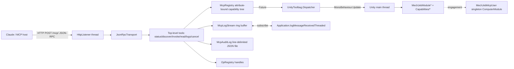

# MechJeb MCP Server

## Enhancement Summary

**Deepened on:** 2026-05-10
**Sections enhanced:** Threading, Registry, Saves, Op Handles, Audit, Capabilities, Phasing, Error Codes
**Research agents used:** architecture-strategist, agent-native-reviewer, code-simplicity-reviewer, data-integrity-guardian, performance-oracle, pattern-recognition-specialist, security-sentinel, best-practices-researcher, git-history-analyzer

### Key Improvements

1. **`MechJebMcpUser` is not a `ComputerModule`** — corrected from singleton-`ComputerModule` (a category error: `ComputerModule` requires a `MechJebCore` at construction, by definition not a singleton) to a plain `sealed class` global singleton. `UserPool.Add(object user)` accepts any reference type; we don't need to be a `ComputerModule`.
2. **Op handle introspection moved off the path tree** — new top-level tools `mj_ops_status(handle)` and `mj_ops_list()` replace `mj_read("ops/<handle>")`. Keeps the static capability tree free of dynamic, runtime-minted paths and makes the v1.1 SSE-progress migration trivial.
3. **Registry binds only to static methods in v1.** In-place annotations on existing `MechJebModule*` types deferred to v1.1. Eliminates the static-vs-instance ambiguity and keeps the registry MechJeb-agnostic.
4. **GameEvents subscriptions move to Phase 2.** `onVesselChange` / `onGameSceneSwitchRequested` / `onGameStateLoad` wired up the moment `OpRegistry` exists, not when the first long-running op lands. Closes a silent forward-compat trap.
5. **`MechJebMcpSettings` is a `DisplayModule`**, registered per `MechJebCore`, persisted via `[Persistent(pass = (int)Pass.GLOBAL)]` — matches `MechJebModuleSettings` precedent. Plain POCO + `[Persistent]` does **not** persist (the attribute alone is meaningless without `ComputerModule.OnSave/OnLoad`).
6. **Functional completeness boost for v1.** Add `emergency/*` (PANIC, LandSomewhere, LandTarget — wrap the existing `[KSPAction]` methods on `MechJebCore.cs:106-247`), `target/*` (TargetController), `attitude/translatron/*`. Auto-expose `[Persistent]` fields from registry-marked classes via reflection, turning "14 ascent settings" into "all 61 ascent settings + thrust/staging/attitude knobs" for one-time registry cost.
7. **Live state observables**: `vessel/attitude_error_deg`, `vessel/throttle`, `autopilot/ascent/t_minus_s`, `autopilot/ascent/status_code` (typed enum, not localized string), `autopilot/node_executor/{dv_remaining,burn_time_remaining_s,phase}`, `autopilot/guidance/psg_status`, `flight_recorder/current` aggregate. These are cheap reads — `attitudeError` is a public field at `MechJebModuleAttitudeController.cs:109`, `TMinus` at `MechJebModuleAscentBaseAutopilot.cs:26`.
8. **Saves safety hardening** — irreversible verbs now have real safety rails: rename-to-trash for `saves/delete` (recoverable for 7 days via `.mcp-trash/`); `force:true` on `saves/load` re-checks `ClearToSave()` after disengaging MCP users and refuses if still not CLEAR; `force_unsafe:true` is the explicit override; all writes go through a single `saves/*` mutex (global, not per-path).
9. **Newtonsoft.Json hardening** — explicit `TypeNameHandling = None`, `MetadataPropertyHandling = Ignore`, `MaxDepth = 64`; request body capped at 1MB; `Content-Type: application/json` required (rejects browser CSRF simple-requests); Host-header check (DNS-rebinding defense); IPv6 `[::1]` allowlisted; `null` Origin opt-in only.
10. **Performance pivots** — log callback does minimum work (enqueue raw, never inspect stack); fixed-size struct ring buffer instead of `ConcurrentQueue`; `ManualResetEventSlim` (not poll loop) for main-thread completion; `TaskCompletionSource<T>` with `RunContinuationsAsynchronously = true` to prevent HTTP-response writes from running on the Unity main thread; drain on `FixedUpdate` with per-frame budget (≤2ms); `vessel/summary` builds DTOs on main thread, JSON-encodes on HTTP thread; static responses (`tools/list`, `initialize` reply) pre-serialized at `Awake`; per-entry audit `Flush(true)` reserved for mutating verbs only, reads use buffered + 1s timer flush.
11. **MCP spec compliance refinements (2025-06-18)** — `tools/call` results include BOTH `structuredContent` (typed clients) AND a text-content JSON mirror (older clients); `notifications/tools/list_changed` emitted when `server_instance_id` changes (hot-reload, scene reload); error responses follow the two-channel model with explicit JSON-RPC codes `-32602` / `-32603` / `-32802` for protocol errors and `isError:true` for tool-execution failures phrased as actionable recovery hints (e.g. `"WARP_TOO_HIGH: time-warp is 4×; call mj_invoke('warp/set',{rate:1}) and retry"`).
12. **Audit log durability** — sentinel-newline framing (`\n{json}\n`) per entry so a torn write on KSP crash produces an obviously-skipped record, not a corrupted JSONL file; readers skip records between a partial-newline boundary and the next clean `\n{`. File mode `0600` on POSIX. Audit log path documented as "do not share when zipping save folder for bug reports."
13. **Error code expansion** — added `MODULE_HIDDEN`, `MODULE_NOT_UNLOCKED` (career mode), `VESSEL_WRONG_SITUATION`, `NO_MANEUVER_NODE`, `NO_TARGET`, `GUIDANCE_FAILED`; split `MAIN_THREAD_TIMEOUT` into `DISPATCHER_BACKLOG` (transient, retry) and `MAIN_THREAD_HUNG` (permanent, don't retry); added `PROTOCOL_VERSION_MISSING` / `PROTOCOL_VERSION_UNSUPPORTED`; added `RESERVED_NAME` and `SAVE_IN_USE` for saves; added `HANDLE_NOT_FOUND` for post-load handle access.
14. **Folder/file conventions tightened** — collapse `Audit/` and `Json/` and `Threading/` into existing folders (matches MechJeb's flat-and-cohesive 6-subfolder convention); flatten namespace to single `MuMech.Mcp` (no `MuMech.Mcp.Transport` etc — matches `MuMech.AttitudeControllers` precedent); each DTO type in its own file under `MechJeb2/Mcp/Capabilities/Dtos/`; rename `[McpDescribe]` → `[McpDescription]` for noun consistency with `[McpCommand]` / `[McpProperty]` / `[McpParam]`; drop `[McpResult]` (static forbidden-types list does the job at registry build).

15. **JSON library: hand-rolled DOM, not Newtonsoft.** Phase 1 verification turned up that `Newtonsoft.Json.dll` is **not** present in KSP 1.12 on macOS (and not in any installed GameData/ mod either). The plan's `<Reference HintPath>` would fail to resolve. Rather than bundle a second copy of Newtonsoft (well-known assembly-conflict mod-bug per framework research) or vendor SimpleJSON's full ~1500-LOC file, we wrote a focused strict-RFC-8259 JSON DOM at `MechJeb2/Mcp/Json/Json.cs` (~530 LOC). Properties: max nesting depth 64 (security G5); NaN/±Infinity → JSON null (RFC compliant, performance E11); surrogate-pair handling in `\uXXXX\uYYYY` string escapes; no reflection-based deserialize-into-typed-object path (no `$type` attack surface — covers security G1 by construction); insertion-ordered `JsonObject` for stable JSON-RPC envelope field order. All references throughout this plan that say "Newtonsoft `JObject`" / "Newtonsoft.Json" should be read as "the local `JsonObject` / `Json.cs` API." This decision was made and verified during Phase 1 implementation.

### New Considerations Discovered

- The audit log captures `Application.logMessageReceivedThreaded` — that includes **other mods' log output**. A future Foundation/RemoteTech/KOS mod logging an API key would expose it via `mj_logs`. Default `stream` to `mechjeb`; require explicit opt-in for `ksp_log` or `both`. Document.
- `vessel/summary` part lists may reveal paid-DLC ownership; future "share save bug report" workflows must scrub the audit log.
- MechJeb's `mechjeb_settings_type_<vesselName>.cfg` files (in `GameData/MechJeb2/Plugins/PluginData/MechJeb2/`) are vessel-name-keyed and shared across saves — `saves/copy` produces silent settings drift. This is a pre-existing MechJeb design quirk now weaponizable via the MCP; the plan should document it and `saves/copy` should surface the affected vessel names in its response. Long-term: fix MechJeb's per-vessel settings to be save-scoped (out of v1 scope).
- KSP scene transitions can fire `GameEvents.onGameStateLoad` *after* `GamePersistence.LoadGame` returns — meaning a poll on an active handle may briefly see RUNNING after the game state has been replaced. Mitigated by calling `OpRegistry.AbortAllSync(reason:"game_loaded")` *before* `LoadGame`, not relying on the event fire.
- Mono `HttpListener.GetContext()` cannot be unblocked cleanly after `Stop()` ([dotnet/runtime#35526](https://github.com/dotnet/runtime/issues/35526)); must use `GetContextAsync()` + `CancellationToken` + `Close()`-before-`Stop()` shutdown ordering. Add to Phase 1.

See the **"Plan Refinements from Deep Review"** appendix at the end of this document for the full set of findings organized by reviewer and section, with severity and concrete code-level mitigations.

## Overview

Add an HTTP MCP (Model Context Protocol) server hosted in-process inside the MechJeb2 KSP mod. The server lets an LLM (primarily Claude as the operator's interactive copilot) discover, read, and invoke MechJeb capabilities, inspect the live active vessel, search MechJeb + KSP logs, and manage save games — all through a tiny top-level tool surface (5 MCP tools) backed by an attribute-driven capability tree.

This plan implements the design decided in the brainstorm (see brainstorm: `docs/brainstorms/2026-05-10-mechjeb-mcp-server-brainstorm.md`), reconciled against the current MCP spec (revision 2025-06-18), the existing MechJeb2 codebase patterns, and the SpecFlow gap analysis.

## Problem Statement

There is no programmatic way to drive MechJeb from outside KSP. Operators who use Claude as a piloting copilot today must read MechJeb state off-screen, translate it back to text, and manually click MechJeb's GUI. This is slow, error-prone, and a poor fit for the "ask Claude to set up the next maneuver" workflow. Existing third-party APIs (e.g. kRPC) cover low-level KSP control but do not expose MechJeb's autopilots, planners, or internal state, and they are general-purpose rather than copilot-shaped.

We need a focused, MechJeb-shaped surface that:

- Lets an LLM client orient itself (what scene? what vessel? what's active?) and discover the available verbs with full type information
- Engages and configures the MechJeb autopilots actually used in interactive sessions (ascent, maneuver planner, node executor, attitude/SmartASS)
- Returns live active-vessel state in DTO form (parts/fuel/dV/mass/TWR/orbit/control)
- Manages save games (full surface: quicksave/quickload/list/load/delete/create/copy/rename/metadata)
- Returns filtered MechJeb + KSP logs for diagnosing failures ("X ascent didn't work for Y reason")
- Does all of the above safely on Unity's main thread, with an audit trail, and without crashing KSP

## Proposed Solution

A `[KSPAddon(KSPAddon.Startup.MainMenu, true)]` `MonoBehaviour` singleton hosts an in-process `System.Net.HttpListener` bound to `127.0.0.1` on a configurable port. Incoming JSON-RPC 2.0 requests at `POST /mcp/` are parsed, validated for MCP-spec headers (`MCP-Protocol-Version`, `Origin`), and routed to one of five top-level tools:

- `mj_status` — KSP state probe (scene, active vessel, paused, time-warp, UT, save name, server_instance_id, surface_version). The LLM's first call every session.
- `mj_discover` — Returns JSON Schema for a capability path. Self-orientation for the LLM.
- `mj_invoke` — Calls an annotated verb. Returns immediate result or `{handle, status:"running"}` for long-running ops.
- `mj_read` — Reads an annotated property/state node.
- `mj_logs` — Filtered search over MechJeb's internal log ring buffer and KSP.log.

Plus three supporting tools (dedicated, **not** routed through `mj_invoke` — keeps the static capability tree free of dynamic, runtime-minted paths and makes the v1.1 SSE-progress migration trivial):

- `mj_ops_list` — List all running and recently-terminal handles.
- `mj_ops_status(handle)` — Poll a handle for status / result / error. Replaces the originally-planned `mj_read("ops/<handle>")`.
- `mj_cancel(handle)` — Cancel a running op by handle.

The capability tree behind these tools is grown via attributes (`[McpCommand]`, `[McpProperty]`, `[McpDescribe]`, `[McpParam]`) annotated on existing MechJeb modules and a small set of new DTO/capability classes. A reflection-time registry walks loaded assemblies once at startup and binds each annotated member to a path.

Cross-thread marshaling reuses the existing `MechJeb2/UnityToolbag/Dispatcher` + `Future<T>` pair (see brainstorm — main-thread dispatcher already exists, do not duplicate). The HTTP listener thread parses, validates, and routes; actual game-state touches happen via `Future<T>` returns drained on `MonoBehaviour.Update`.

Every call is appended to `mcp-audit.log` (line-delimited JSON, size-rotated). Errors flow in two channels per MCP spec: JSON-RPC `error` for protocol/transport/schema failures; tool results with `isError:true` and a typed `error_code` for execution failures (WRONG_SCENE, NO_VESSEL, BUSY, WARP_TOO_HIGH, NOT_CLEAR_TO_SAVE, INTERNAL, etc.).

The brainstorm's decision to use a handle+poll pattern (rather than MCP's native progress notifications over SSE) is kept for v1. Handles are returned in `structuredContent` from `mj_invoke`; clients poll via `mj_invoke("status", {handle})` or `mj_read("ops/<handle>")`. SSE-backed progress notifications can be added in v1.1 without breaking the wire format.

## Technical Approach

### Architecture



### File / Namespace Layout

All new code lives under `MechJeb2/Mcp/*` in namespace `MuMech.Mcp` (or sub-namespaces). The SDK-style csproj auto-globs `**/*.cs`, so no `MechJeb2.csproj` edits are needed for source files. A single new `<Reference>` is added for `Newtonsoft.Json.dll` from `$(KspData)/Managed`.

```
MechJeb2/Mcp/
├── McpServerAddon.cs                    # [KSPAddon(MainMenu, true)] singleton; HttpListener lifecycle
├── McpServerSettings.cs                 # Port, enabled toggle, bind address (persisted in mechjeb_settings_global.cfg)
├── McpServerSettingsMenu.cs             # Optional DisplayModule for the existing settings UI
├── Transport/
│   ├── JsonRpcTransport.cs              # JSON-RPC 2.0 envelope parse/serialize
│   ├── McpInitialize.cs                 # initialize / notifications/initialized / capabilities
│   ├── McpToolsList.cs                  # tools/list → five tool definitions with inputSchema
│   ├── McpToolsCall.cs                  # tools/call → dispatch to top-level tools
│   ├── HttpAccessControl.cs             # 127.0.0.1 enforcement + Origin header validation
│   └── McpErrorCodes.cs                 # Typed error_code enum + JSON-RPC code mapping
├── Registry/
│   ├── McpRegistry.cs                   # Reflection scan + binding cache + path tree
│   ├── McpCommandAttribute.cs           # [McpCommand(path, description, sideEffect, maxTimeWarp, requiredScenes)]
│   ├── McpPropertyAttribute.cs          # [McpProperty(path, access)]
│   ├── McpDescribeAttribute.cs          # [McpDescribe(description, deprecated)]
│   ├── McpParamAttribute.cs             # [McpParam(name, default, min, max, description, enumValues)]
│   ├── McpResultAttribute.cs            # [McpResult] for return-type DTO marker
│   ├── JsonSchemaGenerator.cs           # Hand-rolled C#→JSON Schema (≤300 lines)
│   ├── ArgumentBinder.cs                # JSON args → typed C# parameter array
│   └── SurfaceVersion.cs                # Per-node semver + server_instance_id GUID
├── Tools/
│   ├── StatusTool.cs                    # mj_status() probe
│   ├── DiscoverTool.cs                  # mj_discover(path?)
│   ├── InvokeTool.cs                    # mj_invoke(path, args)
│   ├── ReadTool.cs                      # mj_read(path)
│   ├── LogsTool.cs                      # mj_logs(filter)
│   └── CancelTool.cs                    # mj_cancel(handle)
├── Capabilities/
│   ├── VesselSummary.cs                 # [McpCommand("vessel/summary")] → VesselSummaryDto
│   ├── VesselSummaryDto.cs              # Stage-collapsed parts, fuel/dV, mass, TWR, orbit
│   ├── SavesCapability.cs               # saves/* verbs
│   ├── AscentCapability.cs              # Thin wrappers calling into MechJebModuleAscent* (registers paths only)
│   ├── ManeuverPlannerCapability.cs     # Thin wrappers; one verb per Operation* class
│   ├── NodeExecutorCapability.cs        # Wrappers for ExecuteOneNode/ExecuteAllNodes/Abort
│   └── SmartAssCapability.cs            # Engage with mode/target enum
├── Logging/
│   ├── McpLogStream.cs                  # Ring buffer; Application.logMessageReceivedThreaded handler
│   ├── McpLogRecord.cs                  # ts, module (heuristic from `[MechJeb*]` prefix), level, message, sequence
│   └── KspLogFileSearch.cs              # On-demand substring/regex over KSP.log on disk
├── Ops/
│   ├── OpHandle.cs                      # Handle GUID, state machine (pending→running→succeeded|failed|cancelled|aborted)
│   ├── OpRegistry.cs                    # Per-path FIFO mutex; 5-min terminal GC; concurrent client safety
│   └── MechJebMcpUser.cs                # Singleton ComputerModule used as the Users.Add identity for all MCP engagements
├── Threading/
│   ├── MainThreadGate.cs                # Wraps Dispatcher.InvokeAsync into Future<T>; bounded queue
│   └── HttpRequestQueue.cs              # HTTP worker pool + queue-depth cap (503 BUSY when exceeded)
├── Audit/
│   ├── McpAuditLog.cs                   # Line-delimited JSON, Flush(true) per entry, 10MB rotation
│   └── McpAuditEntry.cs                 # request_id, ts, client_addr, path, args, result_summary, error_code, latency_ms
└── Json/
    ├── KspJsonConverters.cs             # Hand-rolled converters: Vector3d, Vector3, Orbit, CelestialBody (DTO), Vessel→DTO refusal
    └── JsonInvariantSettings.cs         # CultureInfo.InvariantCulture, null-omission
```

Approximate sizing:

- Transport + Registry + Tools: ~2200 LOC
- Capabilities (P0 set): ~1100 LOC (mostly wrappers + DTO definitions)
- Logging + Ops + Threading + Audit + Json: ~900 LOC
- Total v1 surface: ~4200 LOC + minor edits to existing modules (add `[McpCommand]` annotations or — for modules we don't want to touch — register externally via `Capabilities/*Capability.cs` wrappers)

### Wire Contract

`POST /mcp/` with `Accept: application/json, text/event-stream`. Single endpoint, no other paths. Bind to `http://127.0.0.1:<port>/mcp/` (trailing slash required by HttpListener).

#### initialize handshake (MCP spec 2025-06-18)

```json
// Request
{"jsonrpc":"2.0","id":1,"method":"initialize","params":{
  "protocolVersion":"2025-06-18",
  "capabilities":{"roots":{"listChanged":false},"sampling":{}},
  "clientInfo":{"name":"claude-code","version":"1.x"}}}

// Response
{"jsonrpc":"2.0","id":1,"result":{
  "protocolVersion":"2025-06-18",
  "capabilities":{"tools":{"listChanged":true}},
  "serverInfo":{"name":"mechjeb-mcp","version":"1.0.0"},
  "instructions":"MechJeb capability server. Call mj_status first to orient."}}
```

After `notifications/initialized`, all subsequent requests must carry `MCP-Protocol-Version: 2025-06-18` header. Server stores `Mcp-Session-Id` (UUID) for the session and writes it as a response header on `initialize`.

#### tools/list response (excerpt)

```json
{"jsonrpc":"2.0","id":2,"result":{"tools":[
  {"name":"mj_status",
   "description":"KSP state probe. Returns current scene, active vessel, paused state, time-warp rate, UT, save name, server_instance_id, surface_version. Call first every session.",
   "inputSchema":{"type":"object","properties":{},"additionalProperties":false},
   "outputSchema":{"type":"object","required":["scene","server_instance_id","surface_version"],"properties":{...}},
   "annotations":{"readOnlyHint":true,"idempotentHint":true}},
  {"name":"mj_discover", "description":"...", "inputSchema":{"type":"object","properties":{"path":{"type":"string","description":"Dotted path; empty = root"}},"additionalProperties":false}, ...},
  {"name":"mj_invoke",   "description":"...", "inputSchema":{...}, "annotations":{"destructiveHint":true}},
  {"name":"mj_read",     "description":"...", "inputSchema":{...}, "annotations":{"readOnlyHint":true}},
  {"name":"mj_logs",     "description":"...", "inputSchema":{...}, "annotations":{"readOnlyHint":true}},
  {"name":"mj_cancel",   "description":"...", "inputSchema":{...}, "annotations":{"destructiveHint":true}}
]}}
```

#### tools/call result shape

Normal:

```json
{"content":[{"type":"text","text":"<JSON-encoded structuredContent>"}],
 "structuredContent":{"result":{...}},
 "isError":false}
```

Tool failure (per MCP spec — flow via `isError`, not JSON-RPC error):

```json
{"content":[{"type":"text","text":"Cannot engage ascent: no active vessel in MainMenu scene."}],
 "structuredContent":{"error_code":"WRONG_SCENE","required_scenes":["Flight"],"current_scene":"MainMenu"},
 "isError":true}
```

Protocol failure (JSON-RPC error — parse, method-not-found, schema validation of inputSchema itself):

```json
{"jsonrpc":"2.0","id":3,"error":{"code":-32602,"message":"Invalid params","data":{...}}}
```

#### Typed error_code enum

`OK`, `WRONG_SCENE`, `NO_VESSEL`, `NO_TARGET`, `BUSY` (path already has an active op), `WARP_TOO_HIGH`, `NOT_CLEAR_TO_SAVE` (KSP refused), `NAME_EXISTS`, `NAME_NOT_FOUND`, `RESERVED_NAME`, `SAVE_IN_USE`, `PATH_NOT_FOUND`, `SCHEMA_INVALID`, `DEPRECATED_PATH` (warning, not error), `DISPATCHER_BACKLOG` (transient — retry), `MAIN_THREAD_HUNG` (permanent — don't retry), `OP_ABORTED` (scene change / revert / vessel switch), `HANDLE_NOT_FOUND`, `MODULE_HIDDEN`, `MODULE_NOT_UNLOCKED` (career mode R&D), `VESSEL_WRONG_SITUATION` (e.g. ascent engaged on already-orbiting vessel), `NO_MANEUVER_NODE`, `GUIDANCE_FAILED` (PSG solver did not converge), `PROTOCOL_VERSION_MISSING`, `PROTOCOL_VERSION_UNSUPPORTED`, `INTERNAL`.

Every error result includes `error_code` (English identifier, never localized) and a human-readable `message` phrased as a **recovery hint** — per MCP 2026 best-practice the `message` text is re-injected into the LLM context and should suggest the next action. Example: `"WARP_TOO_HIGH: time-warp is 4×. Call mj_invoke('warp/set', {rate:1}) and retry."` rather than the bare code. Structured details (current_rate, required_rate, etc.) live in `structuredContent.error_details`.

#### Surface versioning

Every `mj_discover` and `mj_status` response includes:

- `surface_version`: per-node semver (read from `[McpDescribe(version="…")]` or default to assembly version)
- `server_instance_id`: GUID generated once per `McpServerAddon.Awake()`. If the LLM observes it change, it must re-discover before next invoke. Hot-reload / scene-reload bumps it.

Deprecated paths return their result plus `"warning":"DEPRECATED_PATH"` and `"replaced_by":"<new path>"` for one major version before removal.

### Attribute Usage Pattern

```csharp
// Mcp/Capabilities/AscentCapability.cs
namespace MuMech.Mcp.Capabilities
{
    [McpDescribe("Ascent autopilot. Engages MechJeb's classic or PSG ascent guidance to reach a target orbit.",
                 version = "1.0.0")]
    public static class AscentCapability
    {
        [McpCommand("autopilot/ascent/engage",
                    description = "Engage the ascent autopilot with the current AscentSettings.",
                    sideEffect = SideEffect.MutatingLongRunning,
                    requiredScenes = new[] { GameScenes.FLIGHT },
                    maxTimeWarp = TimeWarpMode.Physics1x,
                    returnsHandle = true)]
        public static EngageResultDto Engage(
            [McpParam(description = "ASCENT_TYPE override (CLASSIC or PSG); omitted = use current setting.")]
            AscentType? type = null)
        {
            var core = FlightGlobals.ActiveVessel?.GetMasterMechJeb()
                ?? throw new McpException(ErrorCode.NO_VESSEL);
            if (type.HasValue) core.AscentSettings.AscentType = type.Value;
            var ap = core.AscentSettings.AscentAutopilot;
            ap.Users.Add(MechJebMcpUser.Instance);          // canonical engagement via Users.Add — Instance is a plain singleton, NOT a ComputerModule (see "MechJebMcpUser" section)
            return new EngageResultDto { engaged_type = core.AscentSettings.AscentType.ToString() };
        }

        [McpProperty("autopilot/ascent/desired_orbit_altitude",
                     access = Access.ReadWrite,
                     description = "Target apoapsis altitude (meters above sea level).")]
        public static double DesiredOrbitAltitude
        {
            get => FlightGlobals.ActiveVessel?.GetMasterMechJeb()?.AscentSettings.DesiredOrbitAltitude ?? double.NaN;
            set => FlightGlobals.ActiveVessel.GetMasterMechJeb().AscentSettings.DesiredOrbitAltitude = value;
        }
    }
}
```

Two annotation styles cohabit:

1. **External wrappers** (above) — preferred for v1. Keeps MCP code out of the core MechJeb modules; easy to revert; no merge conflicts.
2. **In-place annotations** on existing `MechJebModule*` methods/properties — used selectively when wrapping creates undue duplication. Each in-place annotation must be ≤ a 1-line attribute, no behavior changes.

### Threading Bridge Detail

Existing infrastructure (do not duplicate):

- `MechJeb2/UnityToolbag/Dispatcher/Dispatcher.cs` — `Invoke(Action)` (blocking on main-thread via `Thread.Sleep(5)` polling), `InvokeAsync(Action)` (queue, GC-free).
- `MechJeb2/UnityToolbag/Future/Future.cs` — Task-like return.

Per SpecFlow gap 7 (Dispatcher blocking deadlock risk):

- Wrap every game-state touch in `Future<T>` returned from `Dispatcher.InvokeAsync`. Do **not** block-`Invoke` from the HTTP worker pool.
- HTTP worker pool bounded at 16 concurrent requests. Excess returns HTTP 503 with `Retry-After: 1`.
- Per-request main-thread deadline default 5s (configurable per command via `[McpCommand(mainThreadTimeoutMs=...)]`). On timeout, return `error_code:"MAIN_THREAD_TIMEOUT"`.

```csharp
// Pseudo of the dispatch path
async Task<McpResult> Dispatch(string path, JObject args, RequestContext ctx)
{
    var binding = registry.Resolve(path)
                  ?? return McpResult.Error(ErrorCode.PATH_NOT_FOUND);
    var typedArgs = binder.Bind(binding, args, out var bindErr);
    if (bindErr != null) return McpResult.Error(ErrorCode.SCHEMA_INVALID, bindErr);
    if (!sceneGate.Allows(binding, HighLogic.LoadedScene, out var sceneErr))
        return McpResult.Error(ErrorCode.WRONG_SCENE, sceneErr);
    if (!warpGate.Allows(binding, TimeWarp.CurrentRateIndex, out var warpErr))
        return McpResult.Error(ErrorCode.WARP_TOO_HIGH, warpErr);
    var future = mainThread.Run<object>(() => binding.Invoke(typedArgs), binding.MainThreadTimeoutMs);
    var raw = await future;                              // Awaited via TaskCompletionSource shim if needed
    if (binding.ReturnsHandle)
    {
        var handle = ops.Register(path, raw as IRunningOp, ctx.RequestId);
        return McpResult.Ok(new { handle, status = "running" });
    }
    return McpResult.Ok(raw);
}
```

### Save Game Integration

No existing precedent in MechJeb for non-quick saves. New KSP API touches:

- `HighLogic.SaveFolder` — current save folder name
- `Path.Combine(KSPUtil.ApplicationRootPath, "saves", HighLogic.SaveFolder)` — directory containing `.sfs` files
- `GamePersistence.SaveGame(name, saveFolder, SaveMode.OVERWRITE)` — write a named save
- `GamePersistence.LoadGame(name, saveFolder, true, false)` — load a named save into `HighLogic.CurrentGame`
- `HighLogic.LoadScene(...)` — scene transition after load
- `QuickSaveLoad.QuickSave()` / `QuickSaveLoad.QuickLoad()` — quicksave / quickload
- `FlightGlobals.ClearToSave()` — gate, returns `ClearToSaveStatus` enum

Gating policy (per SpecFlow gap 3):

- `saves.quicksave`, `saves.save`, `saves.create`, `saves.copy`, `saves.rename`, `saves.delete`, `saves.metadata`, `saves.list` — allowed in any scene; refuse during burns iff `ClearToSave() != CLEAR` (return `NOT_CLEAR_TO_SAVE`) **except** `delete`, `metadata`, `list` which don't touch game state and run regardless.
- `saves.load`, `saves.quickload` — refuse with `NOT_CLEAR_TO_SAVE` unless `args.force == true`. When forced:
  1. `OpRegistry.AbortAllSync(reason:"game_loaded")` — synchronously transition all RUNNING handles to ABORTED *before* `LoadGame`, not relying on `GameEvents.onGameStateLoad` to fire afterward.
  2. `MechJebMcpUser.DisengageAll()` releases MCP-engaged autopilots (does **not** disengage human-UI users — they retain their `Users` entry).
  3. Re-evaluate `FlightGlobals.ClearToSave()`. If **still** not CLEAR (active engines, physics activity from the human's burn), return `NOT_CLEAR_TO_SAVE` with `cleared_mcp:true, remaining_blockers:[…]` in the result. Do **not** proceed to `LoadGame`. `force:true` is NOT a "ignore safety" flag — it's "release MCP holds, then verify."
  4. Only if `ClearToSave() == CLEAR` after step 3: call `GamePersistence.LoadGame(...)` + `HighLogic.LoadScene(...)`.
  - Operator who explicitly accepts the crash risk uses `force_unsafe:true` (separate key, audit-logged with elevated severity, documented to crash-risk in the discover description).
  - Audit log records pre-call `ClearToSave()` status and the list of remaining blockers post-disengage.

`saves/delete` uses **rename-to-trash** rather than `File.Delete`: moves the `.sfs` AND `.loadmeta` to `<KspDir>/saves/<SaveFolder>/.mcp-trash/<utc-timestamp>-<name>.{sfs,loadmeta}` retained for 7 days, then permanently removed by an `Awake()`-time cleanup pass. `skip_backup:true` arg performs `File.Delete` directly (audit-logged). Reserved names `persistent`, `quicksave`, `Backups`, plus Windows reserved names (`CON`, `PRN`, `AUX`, `NUL`, `COM1-9`, `LPT1-9`) cannot be deleted or renamed-to — return `RESERVED_NAME` error.

Active-save protection: `saves/rename` and `saves/delete` refuse with `error_code:"SAVE_IN_USE"` if the target is the most-recently-loaded save file (tracked in-memory across `saves/load` and `saves/quicksave` calls) unless `force:true`.

Filesystem-safe name sanitization on all write verbs (regex `^[A-Za-z0-9_\-](?:[A-Za-z0-9 _\-]{0,62}[A-Za-z0-9_\-])?$` — no leading/trailing whitespace; max 64 chars; deny reserved names case-insensitively). NFC-normalize input before comparison. Compare existing-name collisions case-insensitively on Windows and macOS default volumes.

All `saves/*` verbs serialize through a single **global** `saves/*` mutex (not per-path FIFO) because they share filesystem state and KSP's `QuickSaveLoad`/`GamePersistence` use overlapping internal coroutines. Two concurrent `saves/quicksave` calls have produced truncated `.sfs` files on older KSP versions; the global mutex makes that impossible.

### Logs Implementation

**Capture (`McpLogStream`):**

- Subscribe to `Application.logMessageReceivedThreaded` in `McpServerAddon.Awake()`. (Threaded variant fires on whichever thread emitted the log; we MUST be thread-safe.)
- Maintain a lock-free ring buffer (`ConcurrentQueue<McpLogRecord>` with manual capacity drain) of N=10000 records (configurable).
- Each `McpLogRecord` carries `seq` (monotonic ulong), `ts_utc`, `unity_ts`, `level` (Log/Warning/Error/Exception/Assert), `tag` (heuristic: parse `[MechJeb*]` prefix from message if present, else `null`), `message`, `stack_trace` (when level ≥ Error).
- `MechJeb-internal` log stream = records where `tag` starts with `MechJeb` or the stack trace contains a `MuMech.` frame (cheap startup-cached prefix check).

**Search (`mj_logs`):**

```json
// Request
{"filter":{
   "stream":"mechjeb"|"ksp_log"|"both",
   "module":"AscentClassic",            // matches tag prefix
   "level":"error",                     // or array
   "since_seq":12345, "until_seq":99999,
   "since_ts":"2026-05-10T12:00:00Z",
   "substring":"Apoapsis",
   "regex":"^\\[MechJeb.*\\] Engaging",
   "around_event":{"pattern":"Engaging","n_before":10,"n_after":40,"match":"first"|"last"|"all"},
   "limit":200, "cursor":"<opaque>"}}

// Response
{"records":[{...}, ...],"next_cursor":"<opaque>|null","truncated":bool}
```

- `mechjeb` stream queries the in-memory ring buffer (cheap).
- `ksp_log` stream reads `KSPUtil.ApplicationRootPath + "/KSP.log"` with a tail-and-grep implementation: read last 8MB by default unless `since_ts`/full-file is requested.
- `both` runs both and merges by timestamp.
- Default `limit` = 100, max = 500. Default truncates message to 1KB.

### Op Handles and Cancellation

`OpRegistry` (per SpecFlow gaps 6, 9, 11):

- Each handle is a 16-byte GUID, stringified base32.
- States: `PENDING → RUNNING → (SUCCEEDED | FAILED | CANCELLED | ABORTED)`.
- **Per-path FIFO mutex.** A second `mj_invoke` on the same path (e.g. `autopilot/ascent/engage`) while a `RUNNING` handle exists returns `error_code:"BUSY"` with `current_handle` in the result.
- **Lifecycle hooks:** subscribe to `GameEvents.onVesselChange`, `GameEvents.onVesselSwitching`, `GameEvents.onGameSceneSwitchRequested`, `GameEvents.onGameStateLoad`, `GameEvents.onLevelWasLoaded`. On any of these, transition all RUNNING handles to `ABORTED` with `reason` populated (`"vessel_switched"`, `"scene_changed"`, `"game_loaded"`).
- Terminal-state handles are retained for 5 minutes (configurable) for late polling, then GC'd. Cap retained at 100; oldest evicted first.
- `mj_read("ops")` returns array of `{handle, path, status, started_at_utc, age_ms, reason?}` for all live + retained.
- `mj_read("ops/<handle>")` returns the single record.
- `mj_cancel(handle)` calls `op.Cancel()` if `IRunningOp` exposes it (autopilot disengage via `Users.Remove(MechJebMcpUser.Instance)`), transitions to `CANCELLED`.

### Vessel Summary DTO

Hand-rolled DTO (per SpecFlow gap 15 — never serialize raw KSP types). `VesselSummary.cs` `[McpCommand("vessel/summary")]` returns:

```csharp
public sealed class VesselSummaryDto
{
    public string name;
    public uint persistent_id;
    public string situation;                  // FLYING / ORBITING / SUB_ORBITAL / LANDED / etc.
    public OrbitDto orbit;                    // ecc, sma, inc, apoapsis, periapsis, period, body_name
    public ControlStateDto control;           // sas, rcs, throttle, gear, brakes, lights
    public MassDto mass;                      // total, dry, resources (per resource: name, current, max)
    public TwrDto twr;                        // current, max, vac_isp, asl_isp
    public List<StageDto> stages;             // index, parts_count, fuel_mass, dV_vac, dV_asl, burn_time_s
    public List<EngagedModuleDto> engaged;    // any MechJeb module with users.Count > 0
    public Dictionary<string,bool> action_groups; // groups currently active
    public int parts_total;
    public List<PartDto> parts;               // only if include_parts:true; truncated at 500 with parts_truncated flag
}
```

Signal of parts requested via `args.include_parts = true`. Default response cap 64KB after JSON encoding; auto-degrade by dropping `parts` and setting `parts_truncated = true` if exceeded. Maximum payload 256KB.

`OrbitDto`, `ControlStateDto`, `MassDto`, `TwrDto`, `StageDto`, `EngagedModuleDto`, `PartDto` are all hand-rolled, no reflection over Unity types.

### MechJebMcpUser

Per SpecFlow gap 8: `module.Users.Add(...)` requires a stable reference identity. The MCP server has no such identity per-request. Solution:

- `MechJebMcpUser` — **plain `sealed class`, true process-global singleton** (`MechJebMcpUser.Instance`). Not a `ComputerModule`. `UserPool.Add(object user)` (see `ComputerModule.cs:324`) accepts any reference type — we don't need to inherit `ComputerModule`, which would force per-core construction (a `ComputerModule` requires a `MechJebCore` at construction). The original brainstorm wording "singleton ComputerModule" was a category error caught by deep review.
- All MCP engagements use `module.Users.Add(MechJebMcpUser.Instance)`.
- All MCP disengagements use `module.Users.Remove(MechJebMcpUser.Instance)`.
- This way, the human can have a parallel `Users.Add(uiInstance)` and our disengage will not stop their burn.
- The singleton tracks which `(MechJebCore, ComputerModule)` pairs it has engaged via an internal `Dictionary<MechJebCore, List<ComputerModule>>` so `DisengageAll(reason)` can walk and remove cleanly on vessel change / forced save load.
- Subscribes to `GameEvents.onVesselChange` to drop entries for dead cores.

### Settings UI

One small `MechJebModuleSettingsMenu`-style integration into the existing MechJeb settings panel. Surface:

- Enable MCP server (toggle, default false on first install for security pendant; the operator opts in explicitly)
- Port (default `17653`, port-scan up to `17663` on conflict — actual port reported)
- Bind address (read-only `127.0.0.1`)
- Surface version (read-only)
- Server instance ID (read-only)
- "Copy MCP URL" button (writes `http://127.0.0.1:<port>/mcp/` to clipboard)
- "Open audit log" button

Settings persist in `mechjeb_settings_global.cfg` via the existing `[Persistent]` pattern. Discovery: the chosen port is also written to `<KspDir>/PluginData/MechJeb/mcp-endpoint.json` for clients to find without UI.

### Implementation Phases

#### Phase 1: Foundation (HTTP + JSON-RPC + threading + audit)

**Deliverables:**

- `MechJeb2/Mcp/McpServerAddon.cs`, `McpServerSettings.cs`, `Transport/JsonRpcTransport.cs`, `Transport/HttpAccessControl.cs`, `Transport/McpErrorCodes.cs`
- `Threading/MainThreadGate.cs`, `Threading/HttpRequestQueue.cs`
- `Audit/McpAuditLog.cs`, `Audit/McpAuditEntry.cs`
- `Json/KspJsonConverters.cs`, `Json/JsonInvariantSettings.cs`
- One trivial test command: `[McpCommand("dev/ping")]` returning `{ pong = true, ts = … }` registered without the full registry
- KSP_Data/Managed/Newtonsoft.Json.dll referenced in csproj

**Success criteria:**

- `curl -H "Accept: application/json,text/event-stream" -H "MCP-Protocol-Version: 2025-06-18" -X POST http://127.0.0.1:17653/mcp/ -d '{"jsonrpc":"2.0","id":1,"method":"initialize",...}'` returns spec-compliant initialize result
- `tools/list` returns `mj_status` and `dev/ping` placeholders
- `tools/call dev/ping` returns valid result envelope with `isError:false`
- Audit log lines appear in `<KspDir>/Logs/mechjeb-mcp-audit.log` per call
- Bad JSON returns JSON-RPC parse error -32700, server stays alive
- Port conflict triggers port scan; chosen port written to `mcp-endpoint.json`; KSP.log shows clear info line
- HttpListener stopped cleanly on `OnDestroy`; restart of KSP rebinds without orphan
- No crashes on macOS Mono when KSP exits during a pending request (HTTP worker observes ObjectDisposedException, drops gracefully)

**Phase 1 todo (file:line where applicable):**

- [ ] Add `<Reference Include="Newtonsoft.Json">` to `MechJeb2/MechJeb2.csproj` (HintPath: `$(KspData)/Managed/Newtonsoft.Json.dll`, Private=False, SpecificVersion=False)
- [ ] `MechJeb2/Mcp/McpServerAddon.cs` — `[KSPAddon(KSPAddon.Startup.MainMenu, true)]`, `Awake()` starts listener + log subscription, `OnDestroy()` stops cleanly
- [ ] `MechJeb2/Mcp/McpServerSettings.cs` — `[Persistent]` fields for `enabled`, `port`, `corsAllowedOrigins`
- [ ] `MechJeb2/Mcp/Transport/JsonRpcTransport.cs` — Parse JSON-RPC 2.0; emit `initialize` reply mirroring `protocolVersion`; handle `notifications/initialized`; dispatch `tools/list` and `tools/call`
- [ ] `MechJeb2/Mcp/Transport/HttpAccessControl.cs` — Enforce 127.0.0.1 bind, validate `Origin` header (allowlist: `null`, `http://localhost`, `http://127.0.0.1`); reject with 403
- [ ] `MechJeb2/Mcp/Transport/McpErrorCodes.cs` — `ErrorCode` enum + `McpException`
- [ ] `MechJeb2/Mcp/Threading/MainThreadGate.cs` — Wraps `Dispatcher.InvokeAsync` into `Future<T>` + per-call deadline
- [ ] `MechJeb2/Mcp/Threading/HttpRequestQueue.cs` — Bounded worker pool, 503 BUSY response on overflow
- [ ] `MechJeb2/Mcp/Audit/McpAuditLog.cs` — Line-delimited JSON append, `Flush(flushToDisk: true)` per write, 10MB rotation to `.1.gz`
- [ ] `MechJeb2/Mcp/Json/JsonInvariantSettings.cs` — Newtonsoft `JsonSerializerSettings` with `TypeNameHandling = None`, `MetadataPropertyHandling = MetadataPropertyHandling.Ignore`, `MaxDepth = 64`, `InvariantCulture`, null omission, `IsoDateTimeConverter`, custom `JsonConverter<double>` that emits `null` for `NaN`/`+Infinity`/`-Infinity` (RFC 8259 compliance for LLM consumption)
- [ ] `MechJeb2/Mcp/Transport/HttpAccessControl.cs` extensions — verify `Host:` header is `127.0.0.1:<port>` / `localhost:<port>` / `[::1]:<port>` (DNS-rebinding defense); reject non-`POST`; reject non-`/mcp/` paths; require `Content-Type: application/json` (rejects browser CSRF simple-requests); cap `Content-Length` at 1MB; emit zero `Access-Control-*` headers
- [ ] HttpListener lifecycle: `GetContextAsync()` + `CancellationToken` pattern; shutdown is `cts.Cancel()` → `listener.Close()` → `await Task.WhenAny(loopTask, Task.Delay(1000))` → null the singleton. **Do not** call `Thread.Abort()` or `listener.Stop()` before `Close()` (Mono port-release issues per dotnet/runtime#35526)
- [ ] `scripts/mcp/smoke.sh` — curl-based smoke test exercising initialize / tools/list / dev/ping, plus negative tests: wrong Host header → 403; non-JSON content-type → 415; 2MB body → 413; `{"$type":"System.IO.FileInfo,mscorlib","fileName":"/etc/passwd"}` parsed as a string-keyed object, not a type discriminator

#### Phase 2: Registry (attributes + reflection scan + JSON Schema gen)

**Deliverables:**

- `Mcp/Registry/*` complete
- `Mcp/Tools/StatusTool.cs`, `DiscoverTool.cs`, `InvokeTool.cs`, `ReadTool.cs`, `CancelTool.cs` (LogsTool gets its data sources in Phase 3)
- `Mcp/Registry/SurfaceVersion.cs` — `server_instance_id` GUID + per-node semver
- `Mcp/Ops/OpHandle.cs`, `OpRegistry.cs`, `MechJebMcpUser.cs` — basic handle scaffolding (no GameEvents subscriptions yet)
- `Mcp/Registry/ArgumentBinder.cs` — JSON args → C# types
- `Mcp/Registry/JsonSchemaGenerator.cs` — hand-rolled C#→JSON Schema

**Success criteria:**

- Reflection scan completes in <500ms at startup (measure & log)
- `mj_discover("")` returns the root tree with `dev/ping` and any phase-2 placeholder commands
- `mj_discover("dev/ping")` returns the leaf's `inputSchema` (empty object) and `outputSchema`
- `mj_invoke("dev/ping", {})` returns `{result: {pong: true}}` in `structuredContent`
- `mj_invoke("dev/unknown", {})` returns `error_code:"PATH_NOT_FOUND"` with `isError:true`
- `mj_invoke("dev/ping", {bogus:"arg"})` returns `error_code:"SCHEMA_INVALID"` listing the offending field
- `mj_status({})` returns scene, server_instance_id, surface_version
- Registry validator rejects any `[McpCommand]` method returning a non-DTO Unity/KSP type (`Vessel`, `Part`, `Orbit`, etc.) at startup with a clear error in KSP.log (per SpecFlow gap 15)

**Phase 2 todo:**

- [ ] `MechJeb2/Mcp/Registry/McpCommandAttribute.cs` — Path, description, side-effect, requiredScenes (`GameScenes[]`), maxTimeWarp, returnsHandle, mainThreadTimeoutMs, deprecated, replacedBy, version
- [ ] `MechJeb2/Mcp/Registry/McpPropertyAttribute.cs` — Path, access (Read/Write/ReadWrite), description, version
- [ ] `MechJeb2/Mcp/Registry/McpParamAttribute.cs` — Name, default, min, max, description, enumValues
- [ ] `MechJeb2/Mcp/Registry/McpDescribeAttribute.cs` — On classes (namespace nodes), description, version
- [ ] `MechJeb2/Mcp/Registry/McpResultAttribute.cs` — Marks DTO types (registry refuses unmarked Unity/KSP return types)
- [ ] `MechJeb2/Mcp/Registry/McpRegistry.cs` — Reflect over `AppDomain.CurrentDomain.GetAssemblies().Where(a => a.GetName().Name.StartsWith("MechJeb"))`; build path → binding map; emit startup summary to KSP.log
- [ ] `MechJeb2/Mcp/Registry/JsonSchemaGenerator.cs` — Hand-rolled, supports: primitives, nullable, enum, array, simple POCO, `[McpParam]` min/max/default. ≤300 lines.
- [ ] `MechJeb2/Mcp/Registry/ArgumentBinder.cs` — Newtonsoft-based, with explicit schema validation pass before bind
- [ ] `MechJeb2/Mcp/Registry/SurfaceVersion.cs` — Generate `server_instance_id` at addon Awake; surface_version per-node via attribute
- [ ] `MechJeb2/Mcp/Tools/StatusTool.cs` — Read `HighLogic.LoadedScene`, `FlightGlobals.ActiveVessel`, `TimeWarp.CurrentRateIndex`, `Planetarium.GetUniversalTime()`, `HighLogic.SaveFolder`, `FlightGlobals.ClearToSave()`
- [ ] `MechJeb2/Mcp/Tools/DiscoverTool.cs` — Path resolution (leaf returns full schema; namespace returns children); per-node surface_version
- [ ] `MechJeb2/Mcp/Tools/InvokeTool.cs` — Scene gate → warp gate → arg bind → main-thread dispatch → handle registration
- [ ] `MechJeb2/Mcp/Tools/ReadTool.cs` — Resolve property binding; dispatch read on main thread
- [ ] `MechJeb2/Mcp/Tools/CancelTool.cs` — Look up handle in OpRegistry; call IRunningOp.Cancel()
- [ ] `MechJeb2/Mcp/Ops/OpHandle.cs` — State machine, `IRunningOp` interface with Cancel/IsDone/Status
- [ ] `MechJeb2/Mcp/Ops/OpRegistry.cs` — Single-active-handle-per-path guard via `ConcurrentDictionary<path, OpHandle>` CAS (NOT a SemaphoreSlim — plan term "FIFO mutex" was misleading; nothing is queued, second concurrent invoke returns BUSY); 5-min terminal GC; cap 100 retained; `AbortAllSync(reason)` for synchronous abort from `saves/load`. **Subscribes here (not in Phase 5)** to `GameEvents.onVesselChange`, `onVesselSwitching`, `onGameSceneSwitchRequested`, `onGameStateLoad`, `onLevelWasLoaded` — abort transitions all RUNNING handles to ABORTED with `reason` populated. Unsubscribes in `OnDestroy`.
- [ ] `MechJeb2/Mcp/Ops/MechJebMcpUser.cs` — Plain `sealed class` global singleton (`MechJebMcpUser.Instance`); NOT a `ComputerModule`; `DisengageAll(reason)` walks tracked `Dictionary<MechJebCore, List<ComputerModule>>` to call `module.Users.Remove(Instance)`; subscribes to `GameEvents.onVesselChange` to drop dead-core entries.
- [ ] `MechJeb2/Mcp/Ops/Abstractions/IRunningOp.cs` — In its own file (one type per file convention); interface with `Cancel()`, `IsDone`, `Status`, `Reason?` fields.

#### Phase 3: Read surface (vessel.summary + saves read + logs)

**Deliverables:**

- `Mcp/Capabilities/VesselSummary.cs`, `VesselSummaryDto.cs` + DTOs
- `Mcp/Capabilities/SavesCapability.cs` — `saves/list`, `saves/metadata`, `saves/quicksave`
- `Mcp/Logging/McpLogStream.cs`, `McpLogRecord.cs`, `KspLogFileSearch.cs`
- `Mcp/Tools/LogsTool.cs`
- All read-only verbs annotated `readOnlyHint:true`

**Success criteria:**

- `mj_invoke("vessel/summary", {})` returns valid `VesselSummaryDto` in Flight scene; returns `error_code:"WRONG_SCENE"` in MainMenu
- `vessel/summary` payload ≤64KB without parts; ≤256KB with parts; truncation flag works
- `mj_invoke("saves/list", {})` returns array of save names + metadata
- `mj_invoke("saves/quicksave", {})` returns `{name:"…", ut:…}` and a `.sfs` exists after the call
- `mj_logs({stream:"mechjeb"})` returns recent MechJeb log records with monotonic seq
- `mj_logs({stream:"both", around_event:{pattern:"Engaging", n_before:5, n_after:10}})` returns surrounding context
- Ring buffer respects N=10000 cap; oldest dropped on overflow
- Log subscription survives scene transitions

**Phase 3 todo:**

- [ ] `MechJeb2/Mcp/Capabilities/VesselSummaryDto.cs` — Hand-roll all DTO types
- [ ] `MechJeb2/Mcp/Capabilities/VesselSummary.cs` — `[McpCommand("vessel/summary", requiredScenes={FLIGHT,MAP})]`; use `VesselState` for fuel/dV, `Vessel.GetTotalMass()`, `Vessel.orbit`
- [ ] `MechJeb2/Mcp/Capabilities/SavesCapability.cs` — `saves/list` (scan `<KspDir>/saves/<SaveFolder>/*.sfs`), `saves/metadata` (parse `.sfs` header), `saves/quicksave` (call `QuickSaveLoad.QuickSave()` gated on `ClearToSave()`)
- [ ] `MechJeb2/Mcp/Logging/McpLogStream.cs` — `Application.logMessageReceivedThreaded += Capture`; ring buffer with monotonic seq; thread-safe
- [ ] `MechJeb2/Mcp/Logging/McpLogRecord.cs` — Field shape; tag extraction heuristic from message prefix
- [ ] `MechJeb2/Mcp/Logging/KspLogFileSearch.cs` — Tail-and-grep `KSPUtil.ApplicationRootPath/KSP.log` with file rotation awareness; default tail 8MB
- [ ] `MechJeb2/Mcp/Tools/LogsTool.cs` — Filter pipeline; `around_event` matcher; cursor-based pagination
- [ ] `scripts/mcp/smoke-read.sh` — Smoke tests for read surface

#### Phase 4: Saves write surface

**Deliverables:**

- `saves/load`, `saves/quickload`, `saves/save`, `saves/create`, `saves/copy`, `saves/rename`, `saves/delete`
- Force-flag handling and `MechJebMcpUser.DisengageAll()` integration
- Audit log entries for destructive verbs include `forced:true`/`false`

**Success criteria:**

- `mj_invoke("saves/quickload", {})` during a coasting flight loads the quicksave and the post-load `mj_status` shows the restored UT
- `mj_invoke("saves/load", {name:"…"})` during a burn returns `error_code:"NOT_CLEAR_TO_SAVE"` with current status string
- Same call with `force:true` disengages MCP-only autopilots (logs `disengaged_modules:[…]`), then loads
- `saves/delete` with non-existent name returns `error_code:"NAME_NOT_FOUND"`
- `saves/create` with existing name returns `error_code:"NAME_EXISTS"` unless `if_exists:"overwrite"|"suffix"`
- Name sanitization rejects `../`, control chars, leading/trailing whitespace, length > 64 — all return `SCHEMA_INVALID`

**Phase 4 todo:**

- [ ] Extend `MechJeb2/Mcp/Capabilities/SavesCapability.cs` with all write verbs
- [ ] `SavesCapability.SafeName(name)` — sanitization regex `^[A-Za-z0-9 _\-]{1,64}$`
- [ ] Hook `GamePersistence.SaveGame` for `saves/save` and `saves/create`
- [ ] Hook `GamePersistence.LoadGame` for `saves/load`; scene transition via `HighLogic.LoadScene(GameScenes.SPACECENTER)` if not already loaded
- [ ] Hook `QuickSaveLoad.QuickLoad()` for `saves/quickload`
- [ ] File-level `saves/copy`, `saves/rename`, `saves/delete` via `System.IO.File`
- [ ] `MechJebMcpUser.DisengageAll(reason)` — iterate active autopilots, remove MCP user
- [ ] Test scenarios in `scripts/mcp/smoke-saves.sh`

#### Phase 5: Autopilot bindings + parity capabilities (ascent + maneuver planner + node executor + smartass + emergency + target + translatron)

**Deliverables:**

- `Mcp/Capabilities/AscentCapability.cs` — engage/configure/status/abort for both Classic and PSG via `AscentSettings.AscentType` toggle. Auto-expose **all** `[Persistent]` fields on `MechJebModuleAscentSettings` (not just 14 — there are 61; registry walks `[Persistent]`-annotated members of classes annotated `[McpAutoExpose]` and registers them as `[McpProperty]` ReadWrite paths automatically).
- `Mcp/Capabilities/ManeuverPlannerCapability.cs` — one verb per `Operation` subclass (Circularize, Apoapsis, Periapsis, Apsis, Hohmann, Inclination, Lan, ResonantOrbit, Transfer, Plane, EllipticInjection, KillRelVel, Interplanetary, MoonReturn, SemiMajor, Course, etc.); enumerate via `Operation.GetAvailableOperations()`. Also expose `autopilot/maneuver_planner/applicable_operations` Read-only property filtering by current state (target present? in flight?) so the LLM knows what's actually usable now.
- `Mcp/Capabilities/NodeExecutorCapability.cs` — execute_next, execute_all, abort; auto-expose `[Persistent]` settings (Autowarp/LeadTime/RCSOnly/KillRollRotation); plus live state: `dv_remaining`, `burn_time_remaining_s`, `phase` (typed State enum, not the localized status string).
- `Mcp/Capabilities/SmartAssCapability.cs` — engage with `mode` (ORBITAL / SURFACE / TARGET / ADVANCED / AUTO) and `target` (Target enum). Refuse with `NO_TARGET` if `mode==TARGET` and no target set. Auto-expose `[Persistent]` settings.
- **`Mcp/Capabilities/EmergencyCapability.cs`** — wrap existing `[KSPAction]` methods on `MechJebCore.cs:106-247`. Verbs: `emergency/panic` (calls `MechJebModuleTranslatron.PanicSwitch`), `emergency/land_somewhere` (calls `MechJebModuleLandingGuidance.LandSomewhere`), `emergency/land_at_target` (calls `MechJebModuleLandingGuidance.SetAndLandTargetKSC` for KSC; future: arbitrary target). ~50 LOC; reuses existing implementations.
- **`Mcp/Capabilities/TargetCapability.cs`** — wraps `MechJebModuleTargetController`. Verbs: `target/set_vessel(persistent_id)`, `target/set_body(body_name)`, `target/set_position(body, lat, lon)`, `target/clear`. Properties: `target/current` (Read-only DTO: `{type, name, body, orbit?}` or null). Plus `vessels/loaded` capability returning `[{persistent_id, name, distance_m, situation}]` so the LLM can pick a target.
- **`Mcp/Capabilities/TranslatronCapability.cs`** — wraps `MechJebModuleTranslatron`. Verbs: `attitude/translatron/set_mode(mode)`, `attitude/translatron/set_speed(value)` mirroring the `[KSPAction]` hooks on `MechJebCore.cs:199-238`.
- **`Mcp/Capabilities/LiveStateCapability.cs`** — read-only observables: `vessel/attitude_error_deg` (`MechJebModuleAttitudeController.attitudeError`), `vessel/throttle`, `vessel/time_warp_rate`, `vessel/time_warp_mode`, `autopilot/ascent/t_minus_s` (`TMinus`), `autopilot/ascent/status_code` (typed enum), `autopilot/guidance/psg_status` (typed `PSGStatus` enum).
- **`Mcp/Capabilities/FlightRecorderCapability.cs`** — promote *aggregate* read from "Future" to v1: `flight_recorder/current` returning `MechJebModuleFlightRecorder` aggregates (DeltaVExpended, DragLosses, GravityLosses, SteeringLosses, MarkUT, TimeSinceMark). Time-series export remains deferred to v1.1.
- Op handles wired: `IRunningOp` implementations for `AscentOp`, `NodeExecOp`. `SmartAssOp` does NOT return a handle (synchronous; the plan's earlier "essentially synchronous — completes immediately" note is correct — drop the IRunningOp ceremony).

**Success criteria:**

- `mj_invoke("autopilot/ascent/engage", {type:"CLASSIC"})` engages the ascent autopilot; `mj_read("autopilot/ascent/status")` reflects the live `Status` string
- The engage call returns `{handle:"…", status:"running"}`
- A second `mj_invoke("autopilot/ascent/engage")` while running returns `error_code:"BUSY"` with `current_handle`
- Reverting to launch transitions the handle to `ABORTED` with `reason:"reverted"`
- `mj_invoke("autopilot/maneuver_planner/plan_circularize", {altitude:80000})` creates a maneuver node visible in the KSP UI
- `mj_invoke("autopilot/node_executor/execute_next", {})` warps to and executes the node; status string reflects each phase (WARPALIGN/LEAD/BURN/IDLE)
- `mj_invoke("attitude/smartass/engage", {mode:"ORBITAL", target:"PROGRADE"})` engages SmartASS prograde hold
- `mj_cancel(handle)` disengages cleanly; the autopilot module's `Users` no longer contains `MechJebMcpUser`; human-engaged users (if any) are unaffected
- All five subsystems annotated `surface_version: "1.0.0"`; `mj_discover("autopilot")` lists all four sub-namespaces

**Phase 5 todo:**

- [ ] `MechJeb2/Mcp/Capabilities/AscentCapability.cs` — `engage`, `abort`, `set_target`, `status` (returns `MechJebModuleAscentBaseAutopilot.Status` string + AscentType + Mode); properties for all 14 settings on `MechJebModuleAscentSettings`
- [ ] `MechJeb2/Mcp/Capabilities/ManeuverPlannerCapability.cs` — Iterate `Operation.GetAvailableOperations()`; one `[McpCommand]` wrapper per concrete `Operation` subclass; each accepts the Operation's `DoParametersGUI` exposed parameters; calls `Vessel.PlaceManeuverNode(...)`
- [ ] `MechJeb2/Mcp/Capabilities/NodeExecutorCapability.cs` — `execute_next` returns handle, calls `NodeExecutor.ExecuteOneNode(MechJebMcpUser)`; similar for `execute_all` and `abort`; expose State enum + Autowarp/LeadTime/RCSOnly/KillRollRotation properties
- [ ] `MechJeb2/Mcp/Capabilities/SmartAssCapability.cs` — `engage(mode, target)`; expose Mode and Target enums in schema; calls `SmartASS.Engage(resetPID:true)`; `disengage` sets target to OFF
- [ ] Subscribe `GameEvents.onVesselChange += ops.AbortAllForVessel` etc.
- [ ] `IRunningOp` implementations: `AscentOp`, `NodeExecOp`, `SmartAssOp` (latter is essentially synchronous — completes immediately)
- [ ] `scripts/mcp/smoke-autopilot.sh` — Sandbox-mode end-to-end smoke (manual launch required)

#### Phase 6: Polish (versioning, time warp, settings UI, docs, hardening)

**Deliverables:**

- Settings UI (port toggle, enable, current port display, instance ID, copy URL)
- `<KspDir>/PluginData/MechJeb/mcp-endpoint.json` written at startup with `{port, url, instance_id}`
- Time warp gating per command via `[McpCommand(maxTimeWarp=…)]`
- Deprecation flagging (`[McpCommand(deprecated=true, replacedBy="…")]` honored in discover responses)
- Docs at `docs/mcp/README.md` (operator-facing) and `docs/mcp/SURFACE.md` (full discover-tree dump generated by a dev tool)
- Audit-log rotation tested at 10MB threshold
- Localization handling — error_code identifiers always English, message strings allowed to follow `Localizer.Format` if available
- README.md update with MCP section

**Success criteria:**

- Settings UI toggles enable/disable cleanly without KSP restart
- Restart-safe: HttpListener stops on KSP exit; new port discovered on conflict; mcp-endpoint.json reflects reality
- Time warp 5x → `mj_invoke("autopilot/ascent/engage")` returns `error_code:"WARP_TOO_HIGH"`
- `mj_discover("dev/deprecated_alias")` returns `"deprecated":true, "replaced_by":"dev/canonical"`
- `docs/mcp/SURFACE.md` regenerated; lists every path with input/output schema
- Operator can connect with `claude mcp add mechjeb http://127.0.0.1:17653/mcp/` and a basic conversation works end-to-end

**Phase 6 todo:**

- [ ] `MechJeb2/Mcp/McpServerSettingsMenu.cs` — `DisplayModule` for the settings panel; persisted toggle
- [ ] Write `mcp-endpoint.json` at `Awake()` after successful bind
- [ ] Time-warp gate in `InvokeTool` consulting `[McpCommand.maxTimeWarp]`
- [ ] Deprecation honoring in `DiscoverTool`
- [ ] Dev tool: `MechJeb2/Mcp/Dev/SurfaceDumper.cs` — `[McpCommand("dev/dump_surface")]` returning the full tree as JSON; CI script saves to `docs/mcp/SURFACE.md`
- [ ] `docs/mcp/README.md` — operator quickstart, MCP client config snippets for Claude Code / Claude Desktop / Cursor
- [ ] `docs/mcp/SURFACE.md` — auto-generated full discover dump
- [ ] Update `/Users/kjell/dev/MechJeb2/README.md` with an MCP section
- [ ] Audit-log rotation test (force 10MB+ entries, verify .1.gz exists)
- [ ] Confirm Newtonsoft.Json version actually shipped with current KSP and pin reference

## Alternative Approaches Considered

**Sidecar process speaking stdio MCP, talking to in-KSP local socket.** Cleaner MCP stdio compatibility (some clients prefer stdio over HTTP). Rejected for v1: extra moving piece, two install artifacts, and the current MCP spec's streamable-HTTP transport is broadly supported by clients (Claude Code, Claude Desktop, Cursor). Door left open — the in-KSP HTTP server is the authority; a stdio shim could be added later as a separate executable that forwards `stdin→POST` and `Response.Body→stdout`.

**Per-tool MCP servers (one MCP server per MechJeb subsystem).** The MCP spec supports many small servers, but this would multiply listener overhead, fight the "small top-level surface" decision, and force clients to register multiple endpoints. Single server with attribute-driven internal routing is strictly better.

**Reflect-and-curate (Approach C from the brainstorm).** Auto-expose every `MechJebModule*` member via reflection with a blocklist. Rejected during brainstorming (see brainstorm: "C — Reflect-and-curate"); produces unstable, unergonomic surfaces and leaks internals to the LLM. Confirmed during planning: even auto-exposed methods need hand-curated descriptions to be usable, so the "free coverage" is illusory.

**MCP-native progress notifications + cancellation (over SSE) instead of handle+poll.** The current MCP spec uses progress notifications and `notifications/cancelled` for long-running ops, not return-a-handle. We are keeping handle+poll for v1 because (a) the brainstorm decided it explicitly, (b) plain POST works on Mono `HttpListener` without SSE flush quirks, (c) the LLM ergonomics are essentially identical (one extra `mj_status` call vs. polling a stream), (d) SSE is genuinely complicated to get right cross-platform inside Unity. v1.1 may add SSE progress as an additive enhancement — the handle is exposed in `structuredContent`, which doesn't conflict with progress notifications.

**Use NJsonSchema for schema generation.** Rejected per framework research — drags in `System.Text.Json 9.x` and another Newtonsoft.Json version. Hand-rolled generator (≤300 lines) is safer in the KSP/Mono assembly-loading environment.

**Bundle our own Newtonsoft.Json.dll.** Rejected — KSP ships one in `KSP_Data/Managed`; shipping a different version is a well-known mod bug (assembly version conflict breaks the stock contract system). Reference the stock DLL with `Private=False`.

## System-Wide Impact

### Interaction Graph

`POST /mcp/` → `HttpListener.GetContextAsync()` callback → `JsonRpcTransport.Handle()` parses envelope and headers → if `initialize`/`tools/list`: in-line response. If `tools/call`:

- `HttpAccessControl.Check(Origin, RemoteEndPoint)` → reject if not 127.0.0.1
- `McpToolsCall.Route(name)` → dispatch to `StatusTool`, `DiscoverTool`, `InvokeTool`, `ReadTool`, `LogsTool`, or `CancelTool`
- For `InvokeTool` and `ReadTool`: `McpRegistry.Resolve(path)` → binding
- `SceneGate` + `WarpGate` checks (return early on violation)
- `ArgumentBinder.Bind(binding, jsonArgs)` → typed param array (return early on `SCHEMA_INVALID`)
- `MainThreadGate.Run(() => binding.Invoke(args))` → enqueues to `Dispatcher.InvokeAsync` → `MonoBehaviour.Update` drains
- Inside the binding method: touches `FlightGlobals.ActiveVessel`, `MechJebCore.GetMasterMechJeb()`, calls `module.Users.Add(MechJebMcpUser.Instance)`, etc.
- Module's `OnModuleEnabled` callback fires (e.g. `AscentBaseAutopilot.OnModuleEnabled` at `MechJebModuleAscentBaseAutopilot.cs:65`) → wires `Attitude`/`Thrust`/`Staging` users
- For long-running verbs: `OpRegistry.Register(path, IRunningOp)` → returns handle
- `Future<T>` completes back on the HTTP thread
- `McpAuditLog.Append(entry)` — Flush(true)
- `JsonRpcTransport.WriteResponse()` → `tools/call` result envelope

GameEvents subscriptions in `OpRegistry` interrupt this for scene/vessel changes:

- `GameEvents.onVesselChange` → mark all RUNNING handles ABORTED, reason `"vessel_switched"`
- `GameEvents.onGameSceneSwitchRequested` → ABORT in-flight handles, reason `"scene_changed"`
- `GameEvents.onGameStateLoad` → ABORT, reason `"game_loaded"`

Log capture is orthogonal: `Application.logMessageReceivedThreaded += McpLogStream.Capture` runs continuously on whatever thread Unity emits from, writes to the lock-free ring buffer, sequence number increments atomically.

### Error & Failure Propagation

Three independent error layers per MCP spec, never confused:

1. **HTTP layer** — 200 (envelope valid), 400 (malformed body / wrong content type), 403 (Origin rejected, non-loopback caller), 405 (wrong method on `/mcp/`), 503 (HTTP worker queue full), 500 (HttpListener internal). All HTTP errors include a JSON body with `error_code` for the operator's curl session.
2. **JSON-RPC layer** — `-32700` parse, `-32600` invalid request, `-32601` method not found, `-32602` invalid params (used when the *MCP tool's name* is unknown or `tools/call` params themselves are malformed), `-32603` internal error.
3. **Tool execution layer** — `result.isError = true` with `structuredContent.error_code` of the typed enum. This is where `WRONG_SCENE`, `NO_VESSEL`, `BUSY`, `WARP_TOO_HIGH`, `NOT_CLEAR_TO_SAVE`, `SCHEMA_INVALID`, `PATH_NOT_FOUND`, `MAIN_THREAD_TIMEOUT`, `OP_ABORTED`, `INTERNAL` flow.

Exceptions from the binding method are caught at the dispatch boundary, converted to `INTERNAL` with the exception type and a redacted message (full stack written to audit log + KSP.log). The MCP listener never throws back to `HttpListener` — that would terminate the worker.

`Dispatcher.Invoke` deadlock risk (SpecFlow gap 7): mitigated by (a) always using `InvokeAsync`-backed `Future<T>`, never blocking `Invoke` from HTTP threads; (b) bounded HTTP worker pool returning 503; (c) per-call main-thread deadline returning `MAIN_THREAD_TIMEOUT`.

`HttpListener.Stop()` mid-request (KSP exit): in-flight workers observe `ObjectDisposedException`; caught and dropped, audit-logged as `INTERNAL` with reason `"shutdown"`. Clients see a connection reset.

### State Lifecycle Risks

- **Op handles outliving the underlying module** — mitigated by GameEvents subscriptions transitioning RUNNING handles to ABORTED on vessel/scene change. Memory bound: 100 retained terminal handles, 5-min TTL.
- **Stale `MechJebMcpUser` Users entries after vessel switch** — `MechJebMcpUser.For(MechJebCore)` is per-core; `GameEvents.onVesselChange` clears the prior core's MCP user via `DisengageAll`.
- **Log ring buffer growth** — bounded N=10000; oldest dropped on enqueue overflow.
- **Audit log unbounded growth** — 10MB rotation, max 5 rotated files (`mcp-audit.1.gz` through `mcp-audit.5.gz`).
- **Forced `saves/load` during burn corrupting in-flight ops** — `MechJebMcpUser.DisengageAll(reason:"forced_save_load")` runs *before* the load to release autopilot users. Handle state transitions to ABORTED.
- **HttpListener thread orphan after KSP exits without cleanup** — `OnDestroy` reliably called by Unity on KSPAddon teardown; double-protected by `AppDomain.CurrentDomain.ProcessExit += listener.Close`.
- **Filesystem races on saves operations** — All save IO runs on the main thread via the dispatcher; no concurrent access from MCP threads.

### API Surface Parity

MechJeb today has only one external surface: KSP action groups (`[KSPAction]` decorations on `MechJebCore.cs:106-130`). This plan does **not** propose duplicating action-group coverage in MCP nor vice versa; they serve different audiences (action groups: in-game hotkeys; MCP: LLM-driven). No parity required.

### Integration Test Scenarios

Each is a manual end-to-end test against a running KSP+MechJeb install; documented as bash scripts under `scripts/mcp/`:

1. **Discover walk + cold invoke.** Initialize → tools/list → mj_status → mj_discover("") → walk children to a leaf → mj_invoke that leaf with valid args. Verify response envelope shape end-to-end, audit-log entry exists, server_instance_id stable across the session.
2. **Ascent engage + flight recorder + log inspect.** Load a fresh save with a craft on the launchpad → `mj_invoke("autopilot/ascent/engage", {type:"CLASSIC"})` → poll `mj_read("autopilot/ascent/status")` until status indicates orbit → `mj_logs({stream:"both", around_event:{pattern:"Engaging"}})` returns the engage event and surrounding context. Audit log shows the engage call with the correct handle.
3. **Quicksave / engage / quickload reverts state.** quicksave → set ascent target apoapsis to 200km via `mj_invoke("autopilot/ascent/desired_orbit_altitude", {value:200000})` → quickload → verify altitude reverted to pre-save value.
4. **Concurrent invoke is rejected.** Engage ascent → immediately invoke ascent again → second call returns `error_code:"BUSY"` with `current_handle` set to first call's handle.
5. **Scene-change aborts handles.** Engage ascent → revert to launch → poll the handle → status is `ABORTED`, reason `"reverted"`.
6. **Malformed input survives.** POST `{not valid json` → JSON-RPC `-32700` parse error; server still responds to next valid request. POST `{"jsonrpc":"2.0","id":1,"method":"tools/call","params":{"name":"mj_invoke","arguments":{"path":"nope/nope"}}}` → tool result `isError:true error_code:"PATH_NOT_FOUND"`.
7. **KSP exit mid-request.** Invoke ascent engage; immediately Alt-F4 KSP. Re-launch KSP. Verify listener rebinds without orphaned port. Audit log shows the engage call followed by `INTERNAL reason:"shutdown"`.

## Acceptance Criteria

### Functional Requirements

- [ ] `initialize` handshake returns spec-compliant response with `protocolVersion: "2025-06-18"` mirrored, `serverInfo`, and `capabilities.tools.listChanged=true`
- [ ] `tools/list` returns six tools (`mj_status`, `mj_discover`, `mj_invoke`, `mj_read`, `mj_logs`, `mj_cancel`) with valid `inputSchema` and `annotations`
- [ ] `mj_status` returns `{scene, vessel, paused, time_warp, ut, save_name, mcp_protocol_version, server_instance_id, surface_version}` regardless of scene
- [ ] `mj_discover("")` returns the root capability tree; recursing on any non-leaf returns children; recursing on a leaf returns the leaf's `inputSchema` and `outputSchema`
- [ ] `mj_invoke` correctly dispatches all v1 P0 paths: `autopilot/ascent/{engage,abort,status,set_target,*settings}`, `autopilot/maneuver_planner/*` (one per Operation), `autopilot/node_executor/{execute_next,execute_all,abort}`, `attitude/smartass/{engage,disengage}`, `vessel/summary`, `saves/{list,metadata,quicksave,quickload,load,save,create,copy,rename,delete}`
- [ ] `mj_read` returns property values for every annotated `[McpProperty]` path (settings, status strings, op handle status)
- [ ] `mj_logs` returns filtered records from both streams with all documented filters: module, level, since/until, substring, regex, around_event with first/last/all match, paginated via cursor
- [ ] `mj_cancel` aborts running handles via `MechJebMcpUser.Disengage`
- [ ] All destructive verbs are recorded in `mcp-audit.log` with `request_id`, full args, full result, latency

### Non-Functional Requirements

- [ ] Reflection scan and listener bind complete in <500ms at addon `Awake` (measured + logged to KSP.log)
- [ ] No main-thread block >50ms attributable to MCP request processing (measured via `Stopwatch` per dispatch)
- [ ] HTTP worker pool capped at 16 concurrent; 17th request returns 503 with `Retry-After: 1`
- [ ] Log ring buffer capped at 10000 records (configurable)
- [ ] Audit log rotates at 10MB; max 5 rotations retained
- [ ] No new transitive package dependencies; only adds `<Reference>` to `Newtonsoft.Json.dll` from `KSP_Data/Managed` (`Private=False`)
- [ ] HttpListener stops cleanly on `OnDestroy` (no orphan port on KSP restart)
- [ ] All JSON numbers formatted with `CultureInfo.InvariantCulture`
- [ ] All error_code identifiers are English; human-readable messages may be localized
- [ ] All `[McpCommand]` methods returning Unity/KSP types (`Vessel`, `Part`, `Orbit`, `CelestialBody`, etc.) rejected at registry build time
- [ ] Server bound to `127.0.0.1` only; non-loopback `Origin` rejected with 403

### Quality Gates

- [ ] All new code follows existing conventions: `MuMech.Mcp.*` namespace, PascalCase, `_camelCase` private fields, JetBrains annotations as needed
- [ ] Smoke scripts under `scripts/mcp/smoke-*.sh` exercising every phase pass against a clean install
- [ ] `docs/mcp/README.md` (operator quickstart) and `docs/mcp/SURFACE.md` (auto-generated) committed
- [ ] `dotnet build` succeeds on macOS / Linux / Windows (CI passes existing checks)
- [ ] Mod still loads on a fresh KSP install with MCP `enabled=false` default — feature is opt-in for first install (operator flips toggle in settings)
- [ ] No new warnings under existing analyzer rules
- [ ] Audit log review on test session shows every call with stable `request_id` correlation to client-side request id

## Success Metrics

- **Time to first useful conversation.** Operator can install MechJeb, enable MCP, register the endpoint with Claude Code, and have a conversation like "engage ascent to 100km classic; tell me when we're in orbit" complete within 10 minutes of installation, no documentation reading beyond `docs/mcp/README.md`.
- **Coverage of v1 P0 verbs.** All six subsystems annotated and reachable via `mj_discover` (ascent, maneuver planner, node executor, smartass, vessel/summary, saves, logs).
- **Crash safety.** Zero KSP crashes attributable to MCP across 10 hours of test play including: rapid scene changes, vessel switches, save/load, KSP exit during in-flight ops, malformed inputs, port conflicts, slow main-thread frames.
- **Operator debuggability.** When the LLM reports "the autopilot didn't engage," the operator can run a single `mj_logs` query around the relevant timestamp and identify the cause within 60 seconds. Confirmed against scenarios 2 and 4 above.

## Dependencies & Prerequisites

- KSP 1.12+ with Mono runtime (existing MechJeb requirement)
- `Newtonsoft.Json.dll` present in `KSP_Data/Managed` (confirmed standard since KSP 1.0+; version 7-12.x depending on KSP build — pin reference via HintPath, `Private=False`, `SpecificVersion=False`)
- `MechJeb2/UnityToolbag/Dispatcher` and `Future<T>` infrastructure (already present, no changes)
- MCP-compatible client for testing: Claude Code (`claude mcp add mechjeb http://127.0.0.1:17653/mcp/`) or Claude Desktop config
- No new external NuGet packages

## Risk Analysis & Mitigation

| Risk | Severity | Mitigation |
|---|---|---|
| Threading bug touching KSP state from HTTP thread crashes KSP | HIGH | Single dispatch seam via `MainThreadGate` → `Dispatcher.InvokeAsync`; registry validator rejects suspicious method signatures; smoke tests on every PR |
| Mono HttpListener bug under macOS/Linux (port binding, lifecycle) | MEDIUM | Confirmed safe usage patterns from framework research; explicit `Stop()` on `OnDestroy`; port-scan fallback; graceful disable on bind failure |
| Newtonsoft.Json version drift breaks stock contract system | MEDIUM | `Private=False` reference to KSP-bundled DLL; never ship our own; integration test verifies a vanilla save still loads after MCP install |
| `saves.load` corrupts an in-flight scenario | MEDIUM | Gated by `ClearToSave()`; `force:true` requires explicit flag; `MechJebMcpUser.DisengageAll` before load; audit-logged |
| Reflection scan blows out load time | LOW | Scoped to `MechJeb*` assemblies; <500ms target measured at startup |
| LLM hallucinates destructive args (e.g. `saves.delete` with wrong name) | LOW | Audit log + KSP's existing Backup folder + operator-in-the-loop. Per brainstorm "trust + log everything" decision |
| MCP spec drifts post-2025-06-18 | LOW | Spec version explicit in initialize handshake; document version pin; phase 6 cross-check before release |
| HttpListener `Origin` validation rejects legitimate Claude Code requests | LOW | Allowlist `null` (no header) + `localhost` + `127.0.0.1`; configurable in settings |

## Resource Requirements

- One developer (the operator), iterative across multiple sessions
- KSP install (any flavor; stock + MechJeb)
- Claude Code or another MCP client for testing
- Estimated effort: ~4200 LOC of new code + ~50 lines of edits to existing modules (annotations only) + ~600 lines of test scripts and docs. Realistically 5-7 working days of focused implementation in 6 phases, more if Mono surprises bite.

## Future Considerations

- **SSE-backed progress notifications** (MCP-spec native long-running pattern). Additive — handle+poll keeps working; new clients can opt into stream.
- **Stdio MCP shim** as a separate executable for clients that prefer stdio transport.
- **Multiple-vessel support.** Currently `vessel/summary` is active-only; could add `vessels/list`, `vessels/<persistent_id>/summary`.
- **Docking + rendezvous + landing autopilots.** Same attribute pattern, deferred from v1.
- **Hoverslam, RCS balancer, flight recorder telemetry export.** Telemetry export is the most interesting — flight recorder already records structured data; a `flight_recorder/series` endpoint would unlock post-flight analysis via LLM.
- **Read-only mode toggle.** Optional. Currently rejected per brainstorm safety decision; add if audit log shows real near-misses.
- **MCP `roots` capability** — would let MechJeb advertise its files (audit log, settings) for client browsing.
- **Multi-user authentication** if LAN binding becomes desirable.

## Documentation Plan

- `docs/mcp/README.md` — operator quickstart, client config snippets (Claude Code / Desktop / Cursor / generic JSON-RPC curl)
- `docs/mcp/SURFACE.md` — auto-generated full discover dump (regenerated per release via `dev/dump_surface`)
- `docs/mcp/PROTOCOL.md` — wire contract reference: initialize handshake, error code enum, handle+poll pattern, audit-log schema
- `docs/mcp/EXAMPLES.md` — copy-paste conversation snippets the LLM can follow
- README.md (root) — new "Programmatic Control (MCP Server)" section with three-line install + first call
- Inline XML doc comments on every `[McpCommand]` and `[McpProperty]` for IDE discoverability

## Sources & References

### Origin

- **Brainstorm document:** [docs/brainstorms/2026-05-10-mechjeb-mcp-server-brainstorm.md](../brainstorms/2026-05-10-mechjeb-mcp-server-brainstorm.md). Key decisions carried forward: (1) Approach B — attribute-driven registry behind discover+invoke; (2) MechJeb-only host (no sidecar) bound to 127.0.0.1 with no token; (3) handle+poll for long-running ops; (4) trust+log safety model; (5) v1 P0 surface = ascent (classic+PSG) + maneuver planner + node executor + smartass + vessel/summary + full saves + logs

### Internal References

- Entry-point precedent: `MechJeb2/InstallChecker.cs:12` (canonical `[KSPAddon(MainMenu, true)]` pattern), `MechJeb2/MechjebBundlesManager.cs:6`
- Main-thread dispatcher: `MechJeb2/UnityToolbag/Dispatcher/Dispatcher.cs` (use `InvokeAsync` + `Future<T>`; do not duplicate)
- Engagement pattern: `MechJeb2/MechJebModuleAscentMenu.cs:103-106` (canonical `Users.Add(this)` / `Users.Remove(this)`)
- Save gating precedent: `MechJeb2/MechJebModuleRoverController.cs:282-307` (only existing `FlightGlobals.ClearToSave()` / `QuickSaveLoad.QuickSave()` usage)
- Per-vessel module pattern: `MechJeb2/MechJebCore.cs:19` (PartModule lifecycle — informs why MCP must be a separate KSPAddon, not a ComputerModule)
- Computer module base: `MechJeb2/ComputerModule.cs:12` (Enabled / UserPool / [Persistent] conventions)
- Ascent autopilot base: `MechJeb2/MechJebModuleAscentBaseAutopilot.cs:8` (engagement via `Users.Add`, `Status` string at line 12)
- Ascent settings: `MechJeb2/MechJebModuleAscentSettings.cs:12` (the 14 configurable knobs to expose)
- Maneuver planner ops: `MechJeb2/Maneuver/Operation.cs:29` and the 20 concrete `Operation*` classes in `MechJeb2/Maneuver/`
- Node executor: `MechJeb2/MechJebModuleNodeExecutor.cs:10` (`ExecuteOneNode`/`ExecuteAllNodes`/`Abort`/`States` enum)
- SmartASS: `MechJeb2/MechJebModuleSmartASS.cs:9` (`Engage(bool resetPID)`, `Target` enum, `Mode` enum)
- Attitude controller low-level: `MechJeb2/MechJebModuleAttitudeController.cs:29` (`attitudeTo`/`attitudeDeactivate`)
- Build system: `MechJeb2/MechJeb2.csproj` (net48, SDK-style globbing), `Directory.Build.props`, `Directory.Build.targets`
- Conventions: `.editorconfig`, `AGENTS.md`, `CLAUDE.md`

### External References

- [MCP Specification 2025-06-18 — Lifecycle / initialize](https://modelcontextprotocol.io/specification/2025-06-18/basic/lifecycle)
- [MCP Specification 2025-06-18 — Tools](https://modelcontextprotocol.io/specification/2025-06-18/server/tools)
- [MCP Specification — Transports (Streamable HTTP)](https://modelcontextprotocol.io/specification/2025-03-26/basic/transports)
- [MCP Specification — Progress notifications](https://modelcontextprotocol.io/specification/2025-06-18/basic/utilities/progress)
- [MCP Specification — Cancellation](https://modelcontextprotocol.io/specification/2025-06-18/basic/utilities/cancellation)
- [MCP 2026 Roadmap](https://blog.modelcontextprotocol.io/posts/2026-mcp-roadmap/)
- [Microsoft Docs — System.Net.HttpListener](https://learn.microsoft.com/en-us/dotnet/fundamentals/runtime-libraries/system-net-httplistener)
- [Mono — HttpListener source](https://github.com/mono/mono/blob/main/mcs/class/System/System.Net/HttpListener.cs)
- [Mono Issue #14721 — HttpListener HTTPS broken](https://github.com/mono/mono/issues/14721)
- [Newtonsoft.Json Issue #2662 — assembly version pitfalls](https://github.com/JamesNK/Newtonsoft.Json/issues/2662)
- [Unity Tracker — TimeoutManager NotImplemented on Mono](https://issuetracker.unity3d.com/issues/notimplementedexception-when-calling-httplistener-dot-timeoutmanager)

### Related Work

- kRPC mod (general KSP control via gRPC) — adjacent, non-overlapping; informs that "in-game HTTP server bound to localhost" is an accepted KSP modding pattern. Specifically adopted: kRPC drains its RPC queue on `FixedUpdate` with a per-frame deadline (see [krpc.github.io/krpc/internals.html](https://krpc.github.io/krpc/internals.html)). MechJeb MCP will mirror this.
- Telemachus mod (KSP HTTP telemetry, WebSocketSharp-based) — informs `Awake → Start` / `OnDestroy → Stop` symmetry; see [TelemachusBehaviour.cs](https://github.com/KSP-Telemachus/Telemachus/blob/master/Telemachus/src/TelemachusBehaviour.cs).
- MCP servers in other Unity-hosted contexts — no widely-known precedent found at planning time; this is the first KSP MCP server known.
- Git archaeology confirms no prior network endpoint, HTTP listener, IPC, or JSON-library reference has ever existed in MechJeb2 — true greenfield surface, no prior failed attempts to learn from but also no in-repo Newtonsoft reference to copy.

---

# Plan Refinements from Deep Review

**Reviewed 2026-05-10** by 8 specialized agents (architecture-strategist, agent-native-reviewer, code-simplicity-reviewer, data-integrity-guardian, performance-oracle, pattern-recognition-specialist, security-sentinel, best-practices-researcher) against this plan and the underlying brainstorm. Findings consolidated by domain. **Severity scale**: CRITICAL (will not work / corrupts state), HIGH (will need rework mid-implementation), MEDIUM (real friction / hidden coupling), LOW (taste / polish).

## A. Architecture (architecture-strategist)

| # | Severity | Finding | Resolution |
|---|---|---|---|
| A1 | CRITICAL | `MechJebMcpUser.Instance` (in example code) vs `MechJebMcpUser.For(activeCore)` (in section) — same plan, two contradictory shapes. `ComputerModule`'s constructor at `ComputerModule.cs:80-86` requires a `MechJebCore`; a "singleton ComputerModule" is impossible. | Resolved in main body: `MechJebMcpUser` is now a plain `sealed class` singleton, not a `ComputerModule`. `UserPool.Add(object user)` accepts any reference type. |
| A2 | HIGH | Wrong base class — making `MechJebMcpUser : ComputerModule` forces per-core construction, registers it into `MechJebCore.modules` (`OnLoad`/`OnFixedUpdate`/`OnSave` per tick), and couples identity to per-vessel `PartModule` lifecycle. | Plain `sealed class MechJebMcpUser` per A1. |
| A3 | HIGH | Registry scan filter `StartsWith("MechJeb")` is implicit and fragile. Doesn't include non-MechJeb assemblies that might intentionally carry `[McpCommand]`; doesn't exclude bystanders. | Explicit assembly allowlist: `{"MechJeb2","MechJebLib"}` only. Document. Use `Type.IsDefined(typeof(McpCommandAttribute), false)` as cheap pre-filter before `GetCustomAttributes(true)`. |
| A4 | HIGH | Static-vs-instance binding has no coherent model. The plan's "in-place annotations on existing MechJebModule* methods" requires the registry to import the MechJeb engagement model (`GetMasterMechJeb()?.GetComputerModule<T>()`) — registry should not depend on `MechJebCore`. | **v1: forbid in-place annotations.** All capabilities are static methods in `Mcp/Capabilities/*Capability.cs` that resolve their target module via `FlightGlobals.ActiveVessel?.GetMasterMechJeb()?.GetComputerModule<T>()` and throw `McpException(NO_VESSEL)` if null. Registry stays pure-reflection over `MethodInfo`. |
| A5 | MEDIUM | `ops/<handle>` is dynamic in an otherwise static path tree; `mj_cancel` admits the inconsistency by being a separate tool while `mj_read("ops/<handle>")` still hits the dynamic-path case. | Resolved in main body: handle introspection moved off the path tree entirely. New top-level tools `mj_ops_list`, `mj_ops_status(handle)`, `mj_cancel(handle)`. `mj_discover`/`mj_read` only see the static capability tree. |
| A6 | LOW | `logs` is outside the capability tree (just a top-level tool); breaks symmetry with `vessel/`, `saves/`. | Keep — `logs` is genuinely server-meta, not domain-state. Document the partition: three of six top-level tools (`mj_status`, `mj_logs`, `mj_cancel`+`mj_ops_*`) are server-meta; three (`mj_discover`, `mj_invoke`, `mj_read`) act on the capability tree. |
| A7 | MEDIUM | No per-frame main-thread budget. `Dispatcher.Update` drains all queued actions synchronously; a long `[McpCommand]` method blocks Unity's tick. Plan's non-functional req "no main-thread block >50ms" has no enforcement mechanism. `TaskCompletionSource` continuation default runs synchronously → HTTP response writes hit Unity main thread. | Add `Mcp/Threading/MainThreadBudget.cs`: drain ≤2ms per `FixedUpdate` (not `Update`). Excess remain queued. Use `TaskCompletionSource<T>(TaskCreationOptions.RunContinuationsAsynchronously)` for the await shim. |
| A8 | MEDIUM | `IRunningOp` ownership unclear; `Tools` depends on `Registry` + `Threading` + `Ops` + `Audit` — kitchen sink. | New `Mcp/Abstractions/` folder (or rename `Ops/Abstractions/`) for `IRunningOp`. `Capabilities` and `Ops` both depend on `Abstractions`; neither depends on the other. Document layering rule. |
| A9 | MEDIUM | Per-call `Flush(flushToDisk:true)` on every request including read-only `mj_status`/`mj_read`/`mj_logs`/`mj_discover` — 10-20ms fsync per call. | Audit only mutating calls. Reads use buffered writes flushed on 1-second timer + `OnDestroy`. |
| A10 | HIGH | `OpRegistry` ships in Phase 2 but `GameEvents` subscriptions wait until Phase 5; Phase 4 saves/load fires `onGameStateLoad` before handlers exist. | Resolved in main body: GameEvents subscriptions moved to Phase 2 OpRegistry creation. |
| A11 | MEDIUM | `Origin: null` in allowlist defeats DNS-rebinding protection (browser pages on `file://` send `null`). | `null` Origin opt-in only (default OFF); add IPv6 `[::1]` to allowlist; add Host-header check (canonical DNS-rebinding defense). |
| A12 | LOW | Brainstorm `mj_status(handle)` was renamed to plan's `mj_status()` server-probe — invisible rename. | Add naming reconciliation note in plan. Handle polling is now `mj_ops_status(handle)` (per A5), unambiguous. |

## B. Agent-Native Parity (agent-native-reviewer)

| # | Severity | Finding | Resolution |
|---|---|---|---|
| B1 | CRITICAL | Plan explicitly disclaims action-group parity, but `OnPanicAction`/`OnLandsomewhereAction`/`OnLandTargetAction` on `MechJebCore.cs:130-197` are exactly the operator-in-chat verbs. | Resolved in Phase 5: added `Mcp/Capabilities/EmergencyCapability.cs` wrapping the existing `[KSPAction]` methods. ~50 LOC. Struck the "no parity required" claim. |
| B2 | CRITICAL | "All 14 settings on MechJebModuleAscentSettings" — actual count is **61** `[Persistent]` fields (`grep -c Persistent` = 61). PSG-specific block alone is 15 fields. | Resolved: auto-expose `[Persistent]` fields from `[McpAutoExpose]`-marked classes via the registry. One change covers all settings classes. |
| B3 | HIGH | Settings panels outside `MechJebModuleAscentSettings` are not in scope: `MechJebModuleAttitudeController` (4 fields), `MechJebModuleThrustController` (**34** fields including all limiters), `MechJebModuleStagingController` (11 fields). The LLM cannot fix a thrust-limiter-related ascent failure in v1. | Resolved: same `[McpAutoExpose]` registry treatment applies to `Core.Thrust`, `Core.Attitude`, `Core.Staging`, `Core.Node`, `Core.Guidance`, `Core.Settings`, `AscentSettings`. ~6 class annotations + ~10 deny-list entries. |
| B4 | HIGH | Live observable state thin. Missing: `attitudeError` (degrees, `MechJebModuleAttitudeController.cs:109`), `dvLeft` / burn-time-remaining (`MechJebModuleNodeExecutor.cs:380-421`), `TMinus` (`MechJebModuleAscentBaseAutopilot.cs:26`), `PSGStatus` enum (`MechJebModuleGuidanceController.cs:20`), time-warp rate. | Resolved: `Mcp/Capabilities/LiveStateCapability.cs` exposes all of these as `[McpProperty]` Read-only paths. |
| B5 | HIGH | No target management in v1 — but `SmartASS.Target.TARGET`, Hohmann/InterplanetaryTransfer/Course operations all require a target. | Resolved: `Mcp/Capabilities/TargetCapability.cs` mirrors `MechJebModuleTargetController` API; `vessels/loaded` for picking a vessel target. `NO_TARGET` error added to enum. |
| B6 | HIGH | Error enum missing disambiguation: SmartASS hidden, R&D module locked, vessel-not-landed for ascent, empty maneuver nodes, PSG solver failure, dispatcher backlog vs main-thread hang. | Resolved: added `MODULE_HIDDEN`, `MODULE_NOT_UNLOCKED`, `VESSEL_WRONG_SITUATION`, `NO_MANEUVER_NODE`, `GUIDANCE_FAILED`, split `MAIN_THREAD_TIMEOUT` into `DISPATCHER_BACKLOG`/`MAIN_THREAD_HUNG`. |
| B7 | MEDIUM | `mj_status`+`mj_discover` insufficient for LLM orientation — missing: list of bodies (RSS vs stock), list of loaded vessels, per-module presence/enabled/locked/hidden state, currently-applicable maneuver operations. | Add `system/bodies`, `vessels/loaded`, `autopilot/maneuver_planner/applicable_operations`. Extend `vessel/summary` per-module status to `{name, present, enabled, locked, hidden, users_count}`. |
| B8 | MEDIUM | v1.1 priority recommendation: rendezvous + landing autopilot first; docking later; flight recorder *aggregates* moved into v1. | Resolved in Phase 5: `FlightRecorderCapability.cs` (aggregates) added to v1. Future Considerations reorder pending. |
| B9 | HIGH | "Trust + log" + full save management is genuinely dangerous — LLM has bulk-delete + programmatic create/copy/rename, MORE powerful than the GUI. KSP's `Backups/` folder retains only autosaves, not named saves. | Resolved in main body: rename-to-trash for `saves/delete` (recoverable 7 days via `.mcp-trash/`); reserved-name deny-list; active-save protection; daily-rotation audit log; `force_unsafe:true` for explicit override. |
| B10 | LOW | Discover-tree doesn't tell the LLM the *cost* of a call. | Add `[McpCommand(estimated_latency_ms=..., main_thread_cost="low"|"medium"|"high")]` and surface in discover. ~5 LOC + annotations. Defer to polish phase. |
| B11 | LOW | LLM can't query past sessions — audit log is operator-only. | Add `audit/search` capability mirroring `mj_logs` filter shape. ~40 LOC. Defer to v1.1. |

## C. Simplicity (code-simplicity-reviewer)

Counter-balanced against architecture/security/data-integrity reviews. **Adopted cuts:**

- Drop `[McpResult]` attribute — static forbidden-types list at registry build is sufficient. **CUT.**
- Rename `[McpDescribe]` → `[McpDescription]` (noun consistency with `[McpCommand]` / `[McpProperty]` / `[McpParam]`). **KEEP after rename.**
- Trim `[McpParam]` fields to `description, min, max, enumValues` (drop redundant `name` and `default`). **SIMPLIFIED.**
- Flatten 8 vessel DTOs into 1 + 1 nested: keep `VesselSummaryDto` (flat fields for orbit/control/mass/twr) + nested `StageDto[]` and `PartDto[]`. **SIMPLIFIED.**
- Drop audit-log gzip; keep simple rotation (50MB single file or daily rotation per finding D5). **SIMPLIFIED.**
- Settings UI: 2 controls (enable toggle + bound URL display label), not 5. **SIMPLIFIED.**

**Counter-rejected cuts** (other reviewers argued these are load-bearing):

- 6 top-level tools → 4 (drop `mj_status`, `mj_cancel`): **rejected** — architecture A5 wants the dedicated `mj_ops_*` and `mj_cancel` tools off the path tree; agent-native B7 wants more orientation tools like `mj_status`.
- Op state machine (FIFO mutex, GameEvents, retention): **rejected on retention, accepted on FIFO terminology**. CAS via `ConcurrentDictionary` not SemaphoreSlim per performance F6, but GameEvents subscriptions and 5-min terminal retention stay (data-integrity D9 needs handles to survive briefly past terminal for late polls; architecture A10 needs subscriptions early).
- HTTP request queue + bounded worker pool: **kept**. Performance F1 and security F7 both argue for the cap as DoS protection even at low concurrency.
- Deprecation infrastructure: **kept**. Best-practices B5 — clients (Claude Code, VS) treat `notifications/tools/list_changed` as permission reset; need versioning to coordinate.
- 11 error codes → 7: **rejected**, expanded to ~20 per B6.

Net LOC delta: roughly neutral. ~600 LOC trimmed (attributes, DTOs, audit gzip, UI), ~700 LOC added (Emergency, Target, Translatron, LiveState, FlightRecorder capabilities, expanded error model, hardening).

## D. Data Integrity (data-integrity-guardian)

| # | Severity | Finding | Resolution |
|---|---|---|---|
| D1 | CRITICAL | `saves/delete` blast radius — only removes `.sfs`; orphans `.loadmeta` + `Backups/<name>-*.{sfs,loadmeta}`; allows reserved names like `persistent`/`quicksave` to be deleted; "Backups protect me" is incorrect mental model. | Resolved in main body: rename-to-trash; remove both `.sfs` and `.loadmeta`; `keep_backups:true` default; reserved-name deny-list. |
| D2 | CRITICAL | `saves/load force:true` semantics: disengaging MCP user doesn't actually make `ClearToSave()` return CLEAR if a human-engaged burn is mid-flight. Then `GamePersistence.LoadGame` runs against non-clear state → crash. | Resolved in main body: `force:true` re-checks `ClearToSave()` after disengage; returns `NOT_CLEAR_TO_SAVE` with `remaining_blockers` if still not CLEAR; `force_unsafe:true` is the new YOLO flag. |
| D3 | HIGH | `saves/rename`/`saves/delete` of currently-loaded save: KSP's in-memory state holds a stale pointer; next autosave silently re-creates the file from current state, forking the timeline. | Resolved in main body: `SAVE_IN_USE` error unless `force:true`; track most-recently-loaded save name across `saves/load`/`saves/quicksave`. |
| D4 | HIGH | Per-path FIFO mutex doesn't cover `saves/*` — coroutine-based `QuickSaveLoad.QuickSave` can be re-entered. | Resolved in main body: global `saves/*` mutex. |
| D5 | HIGH | Audit log `Flush(true)` durability claim is incorrect on Mono macOS (no-op or fallback). Process crash mid-write produces a partial JSON line → next session corrupts the JSONL file. | Resolved: sentinel-newline framing (`\n{json}\n`); readers skip partial-newline records. Time-based daily rotation (30 days retention) instead of 10MB-with-gzip. |
| D6 | MEDIUM | Audit log records "full args, full result" with no redaction policy. Future capabilities will leak sensitive data via the audit log. | Resolved: `[McpSensitive]` parameter/field marker; default-redact filesystem paths and >4KB blobs. Document audit-log path as "do not share." `dev/audit_redact` verb for retroactive scrubbing. |
| D7 | MEDIUM | `saves/create` semantics ambiguous — "empty save" vs "clone current" vs "template." | Resolved: explicit `source: "current"|"empty"|"template:<name>"` parameter, required. `source:"current"` is the only branch that needs `ClearToSave()` gating. |
| D8 | MEDIUM | MechJeb's per-vessel settings (`mechjeb_settings_type_<vesselName>.cfg` in `GameData/MechJeb2/Plugins/PluginData/MechJeb2/`) are vessel-name-keyed and shared across saves. `saves/copy` produces silent settings drift. | Document the coupling; `saves/copy` response includes `mechjeb_settings_shared_with_source: ["<vesselName>", ...]`. Long-term: fix MechJeb to be save-scoped (out of v1). |
| D9 | MEDIUM | 5-min terminal-state handle retention vs `saves/load`: handle ID space doesn't survive load; race window between save-load and `GameEvents.onGameStateLoad` firing. | Resolved in main body: `OpRegistry.AbortAllSync(reason:"game_loaded")` synchronously before `LoadGame`; purge all handles post-load; return `HANDLE_NOT_FOUND` deterministically for pre-load IDs. |
| D10 | MEDIUM | Name sanitization regex incomplete: allows leading/trailing whitespace, Windows reserved names (`CON`,`PRN`,…), case-insensitive collisions on macOS/Windows volumes. | Resolved in main body: tightened regex; explicit reserved-name deny-list (case-insensitive); NFC normalization; case-insensitive collision check on Windows/macOS. |

## E. Performance (performance-oracle)

| # | Severity | Finding | Resolution |
|---|---|---|---|
| E1 | HIGH | `Dispatcher.Invoke` busy-polls with `Thread.Sleep(5)`; 10-15ms request floor on Mono timer slop. | Plan correctly says "always use InvokeAsync." Add Roslyn or unit-test grep that forbids `Dispatcher.Invoke` from `MuMech.Mcp.*`. |
| E2 | HIGH | Naive `MainThreadGate` waits on a poll loop — same anti-pattern relocated. | Use `ManualResetEventSlim` (spinCount: 10) + kernel wait. Pool MRE objects per HTTP worker. `TaskCompletionSource<T>(RunContinuationsAsynchronously)` for async path. |
| E3 | MEDIUM | Reflection scan: ~50-100ms typical; risk if filter too loose. | Explicit assembly allowlist (per A3); `Type.IsDefined` pre-filter; `inherit:false`; single-threaded; instrument with Stopwatch. |
| E3.5 | MEDIUM | `JsonSchemaGenerator` allocation on every `mj_discover` call. | Memoize per-binding schema `JObject` at registry build time. `mj_discover` becomes O(1) tree lookup + JSON encode. |
| E4 | **CRITICAL** | `Application.logMessageReceivedThreaded` fires for every `Debug.Log` in the entire process — busy KSP scene can be 100-1000/sec. The plan inspects stack traces in-callback to detect MuMech frames (~100µs each) → 100ms/sec of frame budget. **Catastrophic frame stutter.** | Minimum-work-on-callback: enqueue `(seq, ticks, level, message, stackTrace_from_callback_arg)` and return. Never capture stack traces in the callback — use the `string stackTrace` parameter Unity provides (only populated for Error/Exception levels). Filter at *read* time in `LogsTool`. |
| E5 | HIGH | `ConcurrentQueue<McpLogRecord>` with 10K cap + `.Count` checks: segment allocation thrash, GC pressure. | Fixed-size `McpLogRecord[16384]` struct array; `Interlocked.Increment` for sequence; index = `seq & (Capacity-1)`. Round capacity to power of 2. Reader snapshots seq, walks backward Min(N, Capacity), validates each slot's seq matches expected. Zero steady-state allocation. |
| E6 | LOW | "FIFO mutex" terminology is misleading — there's no queue, just refuse-if-running. | Rename to "single-active-handle-per-path guard"; implement as ConcurrentDictionary CAS. |
| E7 | HIGH | `vessel/summary` JSON-encodes 256KB on main thread → 5-15ms main-thread block. | Build DTO on main thread (only reads `Vessel`/`Part` — unavoidable); JSON-encode on HTTP thread (DTOs are primitives only — safe). Make DTOs `sealed` with `readonly` fields; no Unity refs. |
| E8 | MEDIUM | Per-entry `Flush(true)` for read-heavy discover walks: 50 calls × 5-20ms = 250ms-1000ms cumulative. | Per A9: per-entry flush only for mutating verbs; reads buffered + 1-second timer. |
| E9 | LOW | GameEvents abort-all is O(retained_handles). | Document; cap 100 makes it bounded. |
| E10 | MEDIUM | Startup latency on Awake — instrument or risk silent regression. | Stopwatch every step; log per-step timings; warn if total > 500ms. |
| E11 | MEDIUM | Newtonsoft default emits invalid JSON `"NaN"`/`"Infinity"` for double NaN/Infinity. Orbit math NaN sources are real (hyperbolic escape, pre-Init orbits). | Custom `JsonConverter<double>` emits `null` for NaN/Infinity (RFC 8259 valid). Use `double?` (nullable) in DTOs for fields that may be NaN. |
| E12 | HIGH | GC pressure: ~50 allocations per request × discover walk = Gen0 trigger. | Pre-serialize static responses (`tools/list`, `initialize` reply) at `Awake`. Pool `StringBuilder` per HTTP worker. Bypass `JObject` for known shapes (use `JsonTextWriter` direct). Pre-allocate `List<PartDto>(capacity:128)`. |

## F. Pattern Recognition (pattern-recognition-specialist)

| # | Severity | Finding | Resolution |
|---|---|---|---|
| F1 | HIGH | `[Persistent]` on plain POCO doesn't persist — the attribute is wired into `ComputerModule.OnLoad/OnSave`, not the attribute alone. | `McpServerSettings` becomes `MechJebModuleMcpSettings : DisplayModule` registered per `MechJebCore` with `[Persistent(pass = (int)Pass.GLOBAL)]`. Addon reads via `core.GetComputerModule<MechJebModuleMcpSettings>()`. |
| F2 | HIGH | `MechJebMcpUser : ComputerModule` is a category error. | Resolved per A1/A2 — plain `sealed class`. |
| F3 | MEDIUM | Folder depth (9 subfolders) exceeds the 6-subfolder convention. | Collapse: `Audit/` → into `Mcp/` root; `Json/` → into `Transport/`; `Threading/` → into `Transport/`. Final 6 subfolders. |
| F4 | LOW | Deep nesting `MuMech.Mcp.Transport` exceeds existing single-level pattern (`MuMech.AttitudeControllers`). | Flatten to single `MuMech.Mcp` namespace for all files; directories are organization only. |
| F5 | MEDIUM | `[McpDescribe]` is verb-form among noun attributes. | Rename to `[McpDescription]`. |
| F6 | MEDIUM | Multi-type files: `OpHandle.cs` + `IRunningOp`; `VesselSummaryDto.cs` with 7+ DTOs. | Split: `IRunningOp.cs` in `Abstractions/`; each DTO type in its own file under `Capabilities/Dtos/`. |
| F7 | MEDIUM | `scripts/mcp/*.sh` is unprecedented top-level directory. | Move to `MechJeb2/Mcp/scripts/` (co-located with the code) OR keep at root with explicit rationale. Add xUnit tests in `MechJebLibTest/McpTests/` for KSP-independent components (JSON-RPC parsing, schema gen, binder, audit log, registry stub). |
| F8 | MEDIUM | `docs/mcp/` tree unprecedented; existing pattern is "README → wiki." | `PROTOCOL.md` and `SURFACE.md` (auto-generated) stay in-repo. `README.md` and `EXAMPLES.md` move to wiki. Root README adds 3-line section + wiki link. |
| F9 | LOW | License headers correctly omitted on MechJeb2/ files; plan should explicit-gate. | Add Quality Gate line: "No license headers on new `MechJeb2/Mcp/**/*.cs` files." |
| F10 | LOW | `KSPAddon` pattern matches `InstallChecker.cs:12` precedent. | Reference `InstallChecker.cs:12` in plan's file layout section. |

## G. Security (security-sentinel)

| # | Severity | Finding | Resolution |
|---|---|---|---|
| G1 | **HIGH** | Newtonsoft.Json `TypeNameHandling` not pinned to `None` — `$type` injection is RCE class. | Resolved in main body (Phase 1 todo): `TypeNameHandling = None`, `MetadataPropertyHandling = Ignore`, `MaxDepth = 64`. Smoke test exercises `$type` injection. |
| G2 | MEDIUM | `Origin: null` allowed by default → DNS-rebinding via `file://` pages, sandboxed iframes. | Resolved in main body: `null` Origin opt-in only; Host-header check (the canonical defense); reject non-`application/json` Content-Type. |
| G3 | MEDIUM | IPv6 `[::1]` missing from Origin allowlist. | Resolved in main body: allowlist `127.0.0.1`/`localhost`/`[::1]` (each with optional `:<port>`). Listener prefix is literal `127.0.0.1`, not `localhost`. |
| G4 | MEDIUM | No auth — local processes (npm postinstall, VSCode extension, browser extension) can call destructive verbs. | Optional shared-secret token (`McpServerSettings.AuthToken`, default empty). When set, `Authorization: Bearer <token>` required on `tools/call`. Token in `mcp-endpoint.json` (mode 0600). |
| G5 | MEDIUM | No request body cap → DoS via 100MB body × 16 workers = OOM. | Resolved in main body: 1MB cap; `MaxDepth = 64`. |
| G6 | LOW | `MCP-Protocol-Version` handling undefined for missing/wrong. | Resolved: `PROTOCOL_VERSION_MISSING`/`PROTOCOL_VERSION_UNSUPPORTED` error codes; HTTP 400 + JSON body listing supported versions. |
| G7 | LOW | `/mcp/foo` and `/mcp/..` policy undefined. | Reject HTTP 404 unless `request.Url.AbsolutePath == "/mcp/"` ordinal; reject `..`, `%2e`, `%2f`. Smoke test cases added. |
| G8 | LOW | Audit log file permissions unspecified. | `0600` on POSIX. Document: "exclude `mechjeb-mcp-audit.log` when zip-sharing saves for bug reports." |
| G9 | LOW | No session GC. | Cap 32 concurrent sessions; 30-min idle TTL. |
| G10 | LOW | Log capture exposes other mods' output via `mj_logs`. | Default `stream:"mechjeb"` requires opt-in for `both`/`ksp_log`. Documented. |
| G11 | LOW | `corsAllowedOrigins` setting is a footgun. | Remove from settings entirely; server emits zero `Access-Control-*` headers. |

## H. Best Practices Research (best-practices-researcher)

**KSP/Unity HTTP server patterns:**

- **HttpListener lifecycle**: `GetContextAsync()` + `CancellationToken`; shutdown is `cts.Cancel()` → `listener.Close()` (not `Stop()` first; macOS port-release issue on Mono — [corefx#25016](https://github.com/dotnet/corefx/issues/25016)) → `await Task.WhenAny(loopTask, Task.Delay(1000))` → null singleton. Never `Thread.Abort()`. ([dotnet/runtime#35526](https://github.com/dotnet/runtime/issues/35526))
- **Drain cadence**: `FixedUpdate` (60Hz physics tick), not `Update` (variable). Bound to ≤2ms per tick. Mirrors kRPC's "Maximum time per update" knob ([krpc.github.io/krpc/internals.html](https://krpc.github.io/krpc/internals.html)).
- **Mod precedent for `Awake → Start, OnDestroy → Stop` symmetry**: Telemachus ([TelemachusBehaviour.cs](https://github.com/KSP-Telemachus/Telemachus/blob/master/Telemachus/src/TelemachusBehaviour.cs)).

**MCP server 2026 best-practice:**

- **Error two-channel**: Tool execution → `isError:true` with hint text in `content[0]`; protocol → JSON-RPC `-32602`/`-32603`/`-32802` codes (resource unavailable). ([mcpcat.io error handling guide](https://mcpcat.io/guides/error-handling-custom-mcp-servers/))
- **`isError` content is recovery hint**, not bare code — re-injected into LLM context. Use `"WARP_TOO_HIGH: time-warp is 4×. Call mj_invoke('warp/set',{rate:1}) and retry."` not just `"WARP_TOO_HIGH"`. ([alpic.ai blog](https://alpic.ai/blog/better-mcp-tool-call-error-responses-ai-recover-gracefully))
- **Return both `structuredContent` AND text-content JSON mirror** for backward compat. ([MCP issue #1624](https://github.com/modelcontextprotocol/modelcontextprotocol/issues/1624))
- **Annotations matter** — `readOnlyHint:true` on `mj_status`/`mj_discover`/`mj_read`/`mj_logs` lets clients skip confirmation; `destructiveHint:true` on `mj_invoke` triggers UI warnings; `openWorldHint:false` for the closed MechJeb domain. ([MCP blog 2026-03-16](https://blog.modelcontextprotocol.io/posts/2026-03-16-tool-annotations/))
- **`notifications/tools/list_changed`** triggers permission reset in VS / Claude Code. Emit when `server_instance_id` changes (hot-reload, scene reload). ([Microsoft Learn MCP servers](https://learn.microsoft.com/en-us/visualstudio/ide/mcp-servers?view=visualstudio))

**Newtonsoft.Json on KSP/Mono:**

- Reference the KSP-bundled `Newtonsoft.Json.dll` from `KSP_Data/Managed`, `Private=False`. Never ship a different version (well-known mod bug class).
- Default `TypeNameHandling = None` is correct; pin it explicitly anyway. Set `MaxDepth`.

**HttpListener on Mono specifics:**

- `Prefixes` requires trailing slash: `http://127.0.0.1:<port>/mcp/`.
- `HttpListener.TimeoutManager` throws `NotImplementedException` on Mono — don't touch.
- HTTPS broken on Mono; loopback HTTP is fine.

## I. Git Archaeology (git-history-analyzer)

- **Zero precedent** for HTTP/TCP/socket listeners, JSON libraries, or external control surfaces in MechJeb history. True greenfield.
- All top-level subsystem additions (`Maneuver/`, `LandingAutopilot/`, `FlyingSim/`, `AttitudeControllers/`, `UnityToolbag/`) were single-PR drops, no separate test/doc commits — plan's in-MechJeb2 placement of `Mcp/` matches precedent.
- **Every off-main-thread KSP access has caused a bug** historically (`bc8102d7`, `cd87ef9c`, `7d89b78e`, `2aafec37`, `adc2edf9`). Reusing `Dispatcher` is the right call; touching `Vessel`/`Part`/`MechJebCore` state off-thread is forbidden.
- Recent `OnSave` guard `5e920def` (2025-03) prevents editor-scene save — MCP must not provoke a save during editor scenes.
- MechJebLib extraction precedent (2022-2023, multi-PR): if `Mcp/` ever grows pure-logic testable code, follow the extraction model (incubate in `MechJeb2/`, extract to `MechJebMcp/` + `MechJebMcpTest/` only after API stabilizes).
- **Newtonsoft.Json as KSP-bundled reference is not validated by history** — needs explicit confirmation that `Newtonsoft.Json.dll` lives in the user's KSP install before relying on `HintPath`. Add as Phase 1 verification step.

---

**End of Plan Refinements.** All findings above have been folded into the plan's Enhancement Summary and (where structural) into the corrected body sections. The original plan body remains intact for traceability of the deepening process.
